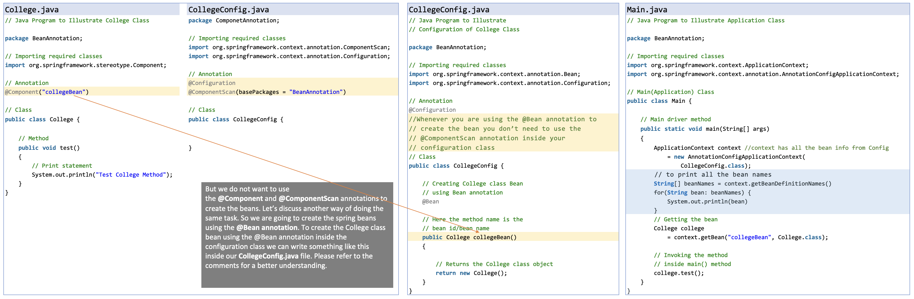

### java-notes
#### 1. @Component : 
  `@Component` annotation declares a class as a Spring component. 
  This signals to Spring that the class should be managed by the Spring container, meaning it will be automatically 
  - created, 
  - initialized, and 
  - potentially injected 
  into other components.

#### 2. application.properties
  Instead of different `application-<env>.properties` file we should create `application.yml` file. Sample `application.yml` can be 
  ```yml
spring:
   application:
      name: demoservice
server:
   port: 8080

---
spring:
   profiles: dev
   application:
      name: demoservice
server:
   port: 9090

---
spring: 
   profiles: prod
   application:
      name: demoservice
server: 
   port: 4431
  ```
Say jar file is `demo-0.0.1-SNAPSHOT.jar` and `environment=prod`<br>
to run it<br>
```bash
  $ java -jar demo-0.0.1-SNAPSHOT.jar --spring-profiles.active=prod
```

#### 3. @Configuration Annotation
In Spring Boot, the `@Configuration` annotation is used to indicate that a class is a source of bean definitions.<br>
It's a core annotation from the Spring Framework, not specific to Spring Boot.<br>
Classes marked with @Configuration can define beans using the @Bean annotation on methods within the class.<br>
These beans are then managed by the Spring container.<br>
`@Configuration` promotes a Java-based configuration approach instead of relying solely on XML configuration files.<br>


Interesting notes from https://www.digitalocean.com/community/tutorials/spring-configuration-annotation
If we remove `@Configuration`, Config class will not be singleton..

#### 4. @RestController
`@RestController`:<br>
  - marks a class as controller for RESTful web requests. 
  - It combines the functionality of @Controller and @ResponseBody. Here's what it does:

`@Controller`
  − Marks the class as a Spring MVC controller
  - responsible for handling incoming HTTP requests.

`@ResponseBody`
 - Tells Spring to serialize the return value of the controller's method directly into the HTTP response body, typically in formats like JSON or XML.


