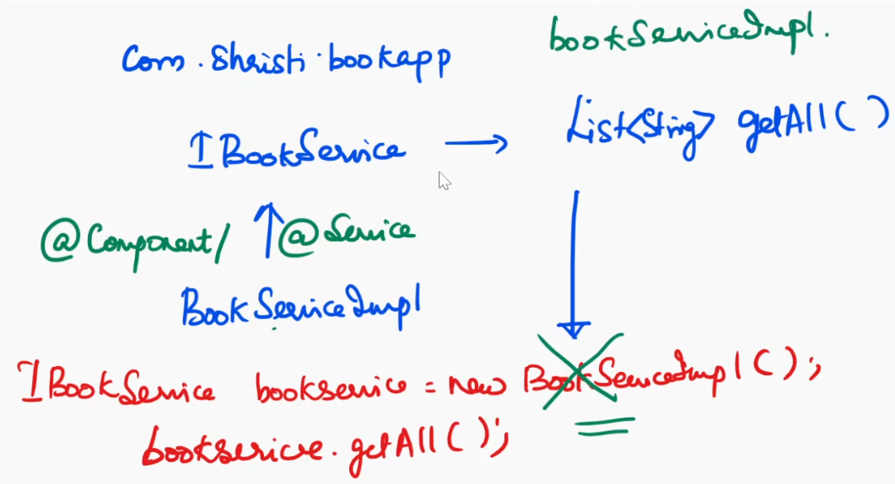

<style>
r { color: Red }
o { color: Orange }
g { color: Green }
sp {background-color: #137a55; color: #DDDDDD; font-weight: bold;}
m2 {background-color:rgb(190, 250, 151); color:rgb(8, 3, 24); font-weight: bold;}
m3 {background-color:rgb(250, 215, 151); color:rgb(58, 3, 33); font-weight: bold;}
</style>

#=========================================================
### Day-1
#=========================================================

<sp>Hey</sp> guys welcome to day one of our 15 days to Spring boot Mastery in this video let us get an
 introduction to Spring framework we will understand 

 <span style="background-color: #137a55">what</span> is Spring <br>
 <span style="background-color: #137a55">why</span> we need Spring framework <br>
 <span style="background-color: #137a55">what</span> are the advantages of using Spring framework <br>
 <span style="background-color: #137a55">what</span> are Spring modules and few other fundamental concepts related to Spring framework <br>
 
 
 now let us get started these are the top
 topics that we will be discussing in this particular video what is Spring why Spring what is dependency injection what
 are the advantages of Spring framework Spring module what is the meaning of <b>IoC</b> 

What is an <b>IoC</b> container the types of <b>IoC</b> container what is a Spring bean and few other fundamental concepts you
 might be wondering why should I learn Spring framework in of directly jumping into Spring boot Spring framework will
 help you to understand the fundamental concepts of Spring which will help you to work with Spring boot easily and
 effectively okay now let us understand 

What is Spring what is Spring?  Spring is an open- Source framework which is used for developing Enterprise applications in Java with Spring framework you can develop Standalone applications that is 
console based applications these applications will run only in the console, 
web applications REST APIs with the help of Spring framework you can also build microservices 
Spring is lightweight and it supports POJO based programming 
what is POJO? -  POJO means Plain Old Java Objects 
whenever you are working with Java the Java applications does not have any external dependencies provided you are not
 working with database you can create an interface you can create implementation class and you can work with Java
 comfortably similarly in case of Spring also you can work with simple Java classes 

okay why do we need Spring framework Spring uses the concept of dependency injection to develop Loosely
 coupled applications what is the meaning of dependency you know the literal meaning of dependency if I am dependent
 for something on a particular person then it is called as dependency let me put it in simple terms here I have a
 mobile assume that this particular mobile uses a specialized charger this means wherever I go I need to take my
 charger together with the mobile because the mobile is dependent on the charger without the charger the mobile cannot be
 charged it means the relationship between these two is they are tightly coupled I hope it is clear now offl most
 of the mobiles can use C type charger assume my mobile also can use C type charger it means I am not dependent on
 my own charger I can just take the mobile and go wherever I want if I want to charge it I can use the charger of
 any other person also provided it is C type in this case the dependency between the charger and the mobile is reduced so
 it is Loosely coupled similarly when you're working with Java applications you will be
 creating multiple classes there are scenarios where the classes are dependent on each other this means that
 they are tightly coupled let me explain

 this with a simple example assume I have two classes 
    1. `Employee` class and the other 
    2. `Address` class

 `Address` class has two instance variables city and state 
 String City;
 String State;


 I have created a default Constructor 
                a parameterized Constructor 
                getter a setter methods 

and two string my `Employee` class also has few properties as in `Employee` name `Employee` ID which is of type integer and now I have address which is of type `Address` class 

this means `Employee` class has an instance of `Address`
`Employee` class is dependent on address 
in `Employee` class also I'm having 
    default Constructor 
    parameter Constructor get a
    set methods and two string 

now I need to create an `Employee` object and assign values for 
  `Employee` name 
  `Employee` ID and
  address

how do we do that either we can go in for a parameterized Constructor or you can use set methods let me show you both 

now first I'm creating an `Employee` object using a default Constructor 

```java
    `Employee` emp = new `Employee`(); 
```

and then I can call 
```java
    emp.setEmpName("Priya");
    emp.setEmpID(10);
```
now I need to set address what will I pass as parameter EMP do set address so in this case I need an address object that has to be passed as parameter so we should already have our address object ready now now I am creating my address object address address is equal to new address of and here I can pass the city and state City
    `Address` address = new `Address`("Bangaluru", "KA");

 and I am passing addresses parameter I hope it is clear now the `Employee` class is dependent on address object so for that first we need to create the address object and explicitly we are injecting the address object using set address method this is one way the other way is while creating the `Employee` object itself new `Employee` during this time itself I can use a parameterized Constructor I can pass the name the ID and the address object 

okay so what is the meaning of it the `Employee` object is dependent on address object and the address object is added to the `Employee` object either 
  using the setter method or 
  using a parameterized Constructor 

this is the scenario that we do in case of Java application as a Java developer it is mandatory that first you need to create the address object and add the address object to the `Employee` object suppose say I don't have a parameterized Constructor I am using Setter method if I forget to inject the address object into the `Employee` object and if I'm trying to get city or if I'm trying to get uh State then there are scenarios where I may get exception it is mandatory that you need to check whether the dependencies are added to the class properly if they are not added then your application will break just like how I told you if my mobile is using a specialized charger it is mandatory that I need to carry it everywhere if I don't carry my charger then in that case I cannot charge by mobile similarly the dependencies needed for a class should be added properly by the developer if somewhere you are missing it then the application will break because they are tightly coupled applications 

<b>then what is the use of Spring framework? </b><br>
  Spring framework uses the concept of *dependency injection* <br>
<b>what exactly is the meaning of it? </b><br>
  Spring is responsible for injecting the Dependencies that are needed for our class <br>
  here I have my `Employee` class <br>
    `Employee` class is dependent on address <br>

  so I need to inform Spring that my `Employee` class is dependent on `Address` so address should be injected into `Employee` object<br>

  <b>who will do that? </b><br>
    Spring framework is responsible for performing this operation <br>
  <b>how will Spring inject the dependencies? </b><br>
   either using the seter method or using the Constructor<br>

  <b>how will Spring know that address is a dependency of `Employee` ?</b><br>
    so for that we will be using certain annotation <br>
    
 I hope it is clear the concept of dependency injection
 when I say dependency injection the dependencies needed for the classes injected automatically by Spring framework 
 
 now the relationship or the dependency between the two classes is completely reduced this will help us to develop Loosely coupled
 applications 
 
 let us go back to the slide Spring uses the concept of dependency injection to develop Loosely coupled applications we will still more see about dependency injection 
 
 Spring has many modules that supports Enterprise development easier
  * in case of Spring if you want to Simply create a console based application Spring has a module which is called a Spring core module 
  * if you want to develop a web application you need to use the module Spring web module 
  * if you want to integrate your Spring application with the database then you can either use Spring jdbc module or Spring data jpa module 
  
  so in case of Spring it is like plug and play if you want to create just a web application without database plug web module if you want to integrate your application only with the database but it is not a REST API 
  plug-in Spring data jpa module okay we will discuss about the modules going forward okay 
  
  now what is dependency injection dependency injection is a concept where the dependencies needed by the class is injected automatically by the framework the same example I have given over here I have two classes `Employee` and `Address` `Employee` class as addresses instance variable 
  now in this case `Address` object should be injected into `Employee` object 
  see this example just like what we have seen earlier both the classes are having their 
  * own properties 
  * default Constructor 
  * parameter Constructor 
  * getter and setter methods and 
  * two string 
  
  now address object has to be injected into `Employee` how do we do that either using a parameterized Constructor or using the seter method just like how we have seen creating an address object creating an `Employee` object injecting the address object into `Employee` object if you're working with the Constructor you need to go for a parameterize Constructor 
  
  this is what we have been doing 
  
  with the help of Spring framework we don't have to do that 
  Spring is responsible for creating the `Address` object and injecting the `Address` object into `Employee` 
  
  guys you need to remember :
    when you are working with Spring framework you will not be using new keyword 
    meaning to say that you will not be creating objects for your class 
    you will inform Spring that I am having these many classes please create objects for my class and 
    inject the appropriate dependencies 
  
  
  in this, scenario I will inform Spring I'm having two classes `Employee` and `Address` 
  please create object for both the classes and inject address object into `Employee` object 
  how do we do that we use certain types of annotation 
  going forward we will see that 
  
  what are the advantages of Spring guys you might be feeling that you are learning more of theory but these are fundamental concepts going forward in the upcoming videos we will be doing many Hands-On examples only if this is clear you will be able to work with the Practical examples easily now let us see the advantages of Spring Spring helps to develop Enterprise applications REST API web applications Spring does not need a application server earlier if I have to create a Enterprise application 
  
  I need to use an application server like JBOSS or Web Logic but now it is not required we can use the Tomcat server which is a
 web server and in case of REST APIs you. You will be working with any embedded Tomcat server which is provided by Spring 
 
<span style="background-color: #137a55">Spring </span>has lightweight <b>IoC</b> containers 

<b><span style="background-color: #137a55">what</span> are these <b>IoC</b> containers?</b><br>
 <b>IoC</b> : Inversion of Control <br>
 these are like supervisors the moment you create your application these containers are responsible for identifying the classes in your application for whom you need to create object what are the dependencies that has to be injected for those particular classes <br>

yeah we will be talking about the <b>IoC</b> container now okay 

Spring is good for deploying applications on computer computers with limited memory and CPU resources guys actually earlier
 we were working with EJB in case of EJB it is very heavyweight meaning to say that the external libraries are more in case of Spring it is not like that so you can work with computers with limited memory 
 
Spring can integrate with any other framework 
  with Spring you can integrate struts which behaves like a front controller 
  with Spring you can integrate hibernate so that if you want to connect to the database 
  you can integrate logging Frameworks 
  you can integrate JEE and JDK timers 
  
Spring helps to translate the technology specific exceptions into consistent unchecked exceptions 
what exactly is the meaning of it:
 this is very important whenever you are working with Java applications if you're working with a database the database throws SQL exception so it is mandatory that you need to use TRY CATCH and 

 If you are creating your own Project Specific exception it is your choice either 
 you can create it as a runtime exception that is an unchecked exception or checked exception 
 
 If you have created it as a check checked exception it is mandatory that you need to handle it try catch if you have created it as a runtime exception like arithmetic or null pointer or number format you don't have to handle it the exception will be thrown in the console in case of Spring also whatever exceptions are coming from the back end will be converted into run time exceptions by Spring automatically and it will be thrown to the console only you will not be encountering any kind of checked exception that is you don't have to use TRY CATCH all the backend exceptions are converted into runtime exceptions and given to you so in no place of your code you will be using TRY CATCH to handle these exceptions the exceptions will be directly thrown to
 the console okay 
 
 Spring provides a consistent transaction management whenever you are working with applications where there are multiple layers the transaction has to be maintained create if you want to create your own user Define transactions you need to use JTA but in case of Spring Spring is responsible for handling the transactions for you 
 
 Testing an application with Spring is easy because it is using Java BEAN style POJOs <br>


 <b><span style="background-color: #137a55">What</span> is Java Bean? </b><br>
   Just now we have seen `Employee` Class A <br>
   Java Bean is a public class with private instance variables public getter and setter of methods one default Constructor <br>

 So, in case of Spring you will be working with Java Bean style POJOs only 

 Remember when I say POJO the classes doesn't extend any other external classes the classes doesn't Implement any other external interfaces they are called as <mark>POJO</mark> - Plain Old Java Objects
 
Now let us see the modules that are available in Spring framework
<br>
<br>

<br>
<br>
<br>

 I'll just do a quick run through of the modules so this is the Spring architecture 
 
 you can see in the bottom layer there is test above that we are having core container 
 the core container has four modules 
 1. beans 
 2. core 
 3. context and
 4. spell 


 that is Spring expression language if you want to develop only Standalone or console based application it is enough that you can work with Spring core module 

 now if you want want to integrate your Spring application with the database then you need to use the data access module as I told you can

 either pick and choose JDBC module ORM, <mark>ORM</mark> means Object Relational Mapping in our case it is <b>Hibernate</b>, using Hibernate I can connect to the database or 
 
 OXM, <mark>OXM</mark> means Object XML Mapping if you're working with XML 

 <mark>JMS</mark> means Java Messaging Services transactions 

 Transactions are already taken Care by string framework so this is your data access module now coming here 

 <b>Web Application</b> <br>
 If you want to create a web application using string framework it is enough that you add Spring web module other than that you are having aop aspects
 instrumentation messaging these are for providing aspect orientation for your application this is the slide which I have got I'll be sharing you the slide in the WhatsApp group you can take the slide from there so these are the modules each module is discussed in detail you can go through this okay now let us enter into the main topic that is

 <span style="background-color: #137a55"><b>IoC</b></span> - <b>Inversion of Control</b> container these are the topics we will be discussing now what is <b>IoC</b> 
 what is the meaning of an <b>IoC</b> container the two <b>IoC</b> containers that are available what is a <b>Spring Bean</b> what is configuration
 metadata I will explain it with a nice pictorial representation then you will get a big picture of how Spring framework works okay what is <b>IoC</b> 
 
 <b>IoC</b> means inversion of control, it is a technique for **decoupling the components** and layers in an application okay 
 Let me explain it with the pictorial representation suppose say I have two classes 
   one is my `Employee` class the
   other one is `Address` class already we have seen this example

 `Employee` class has addresses instance variable so the address object has to be created and added to the `Employee` object either using the Constructor or using the setter method. In these scenarios there is a tight coupling between the classes between the `Employee` class and `Address` class as a Java developer you might have encountered these kind of scenarios but now using the concept of <b>IoC</b> inversion of control the control is reversed meaning to say that the dependencies needed for a class will be injected automatically by the framework
 how again either using the Constructor or using the set method okay so this concept is called as <b>IoC</b> now all these are correct but how Spring will know that I need to create an object and inject the dependency to that particular object let us see the pictorial representation so this is my <b>IoC</b> container inversion of control container now as a Java developer in my application I have created many POJO classes in our case as of now it is `Employee` and address 
 
<b><span style="background-color: #137a55">Annotations</span></b><br>
Now I need to inform the <b>IoC</b> container what are the classes that are available <br>
What are the dependencies for these classes and <br>
What are the objects that has to be be created by the <b>IoC</b> container <br>
so those things are given by something called as <b>Configuration Meta Data</b> <br>
it can be either in the form of XML or <br>
<span style="background-color: #137a55">Annotations</span> are Java base configuration that is Java classes <br>

So what is the meaning of it when you want some system to work you need to feed in data right suppose if you want something to be printed you need to feed in the paper and the ink that is needed for your printer only then you will get the print out similarly in my application that is in my Spring application I need to feed in the Java classes that are available in my application to The <b>IoC</b> container together with that I need to feed in the configuration metadata it can be either in the form of XML or annotations or

 Java base configuration now XML is outdated so we will not be using it

 <span style="background-color: #137a55">What</span> is the meaning of annotation? 
 In my case I have two classes I want the <b>IoC</b> container to create objects for these two classes what should I do?
### @Component
 I can simply go in for an annotation called as 
 `@Component` above ``Employee`` class <br>
 and above the ``Address`` class also I will add `@Component` <br>
 
### @Autowired
 so what the <b>IoC</b> container will do it'll go through this particular package see the classes that are annotated with `@Component` and it will create objects for all these classes but in my case my ``Employee`` class is dependent on ``Address`` how will I inform the <b>IoC</b> container that the ``Employee`` is dependent on ``Address`` so for that there is one more annotation called as `@Autowired`
 
 means automatically wire the dependencies to the object so here automatically the `address` object will be wire to the ``Employee`` object 

 I hope it is clear now the <b>IoC</b> container is reading through the packages identifying the classes that are annotated with `@Component`
 It has to create objects for those classes 
 It is coming to `Address` class `@Component` is available so it will create object 
 next it is coming to the ``Employee`` class `@Component` is available 
 but ``Employee`` is dependent on ``Address`` because you have used `@Autowired` 
 so what it will do is either using the Constructor or using the setter method it will inject the `address` object that is created into the ``Employee`` object 
 
 Suppose if I'm using setter method first it create the `Employee` object and then it will call the setter method to inject the address object into the `Employee` object okay 

 So whatever we have been doing in the form of coding will be taken care by Spring framework it will write the code and it will create the objects <br>
 So you can use `@Autowired` above the seter method or above the Constructor or above the instance variable going forward we will be learning all this <br>
 
 I hope this pictorial representation is very clear so this is <b>IoC</b> container so now till now we have been telling <b>IoC</b> container <br>
 <b>IoC</b> container what exactly it is they are nothing but two main interfaces which are available in the context package <br>
    1. one is <b>Bean Factory</b> and the other one is <br>
    2. <b>Application Context</b> both of them are <b>IoC</b> containers<br>

 technically they are interfaces. These two interfaces are responsible for creating the objects that are needed for your application<br>
 Either you can use <b>Bean Factory</b> or you can use <b>Application Context</b> <br>
 What is the difference between them <br>
     * <b>Bean Factory</b> is the top level interface 
     * <b>Application Context</b> is the sub interface of <b>Bean Factory</b> this has more functionalities and features compared to <b>Bean Factory</b> 

Okay now you have understood what is an <b>IoC</b> container and <br>
what are the two <b>IoC</b> containers that are available so these two <b>IoC</b> containers are responsible for creating the objects and injecting the dependencies needed for these objects in an application <br>
<br>
Okay now <br>
<span style="background-color: #137a55">what</span> are these objects called these objects are called as <b>Spring Bean</b>?<br>
yes <b><b>Spring Bean</b></b> is a Java object which is instantiated and configured by the <b>IoC</b> container in our case the `Employee` object and `Address` object are called as <b>Spring Bean</b> <br>
<br>
Okay now let me go back to the slide so the two <b>IoC</b> containers are <b>Bean Factory</b> and <b>Application Context</b> these are the packages to which they belong <b>Bean Factory</b> is the top level interface <b>Application Context</b> is the sub interface of <b>Bean Factory</b> and it is responsible for instantiating configuring and assembling the Beans what is a Bean a <b>Spring Bean</b> is nothing but a Java object created and configured by the <b>IoC</b> container <br>
Okay there are many implementations of <b>Application Context</b> available while doing the program we will see that okay let us see the pictorial representation as I told you this is the <b>IoC</b> container these are the Java POJO classes and this is the metadata configuration <br>
<br>
My dear guys just like how you are working in Java you will be working in Spring the only thing that Spring is doing for you is creating the objects that are needed for your application nothing more than that okay going forward when you're working with <b>Spring Boot</b> we will be learning about the advanced configurations rather than you creating the object and injecting the differenes the <b>IoC</b> container is responsible for doing all this I will give you a similar analogy if you're working in a company or if you're studying after you go home if you're staying alone it means that you need to do the cooking and take care of the house all by yourself this is similar to a Java application where you need to create the objects and inject the differences but if you have appointed a cook or a maid at home when you go home all the work is done for you the food is ready for you meaning to say that most of the work is done for you similarly if you're working in a Spring application the objects needed for your application will be created and kept ready for you but as a developer it is your duty that you need to write the logic and perform the other operations okay so what is a <b>Spring Bean</b> a <b>Spring Bean</b> is a Java object that is instantiated assembled and configured by the <b>IoC</b> container okay what are the objects how they have to be created what are the dependencies of these objects everything is provided by configuration metadata in our case we will be working<br>

With annotations okay now you need to know how to configure your <b>IoC</b> container guys 
When you are working with <b>Spring Boot</b> the <b>IoC</b> container also will be created by <b>Spring Boot</b> 

But now we have started only with Spring framework so in this case it is our duty that we need to create the <b>IoC</b> container I don't want to push on multiple Concepts in one single day we will be doing a simple program on day three during that time I will explain how to create the <b>IoC</b> container and how to get the objects created by the <b>IoC</b> container so while doing the program we will understand that part 

Okay so we have completed the fundamental concepts of Spring framework so guys I will stop here I don't want to push you with multiple topics at the end of this video you should be confident with 
1. the fundamental concepts 
2. you should know what is Spring framework 
3. what are the advantages of Spring framework 
4. what is the meaning of dependency injection 
5. what is <b>IoC</b> containers 
6. the two types of <b>IoC</b> containers 
7. what is a <b>Spring Bean</b> and 
8. the Spring modules 
you might have heard about the types of dependency injection and much more things we will be covering it in step by step in the upcoming videos if you're having any doubts related to these topics you can ask them in the comment section or in the WhatsApp group I'm always happy to help let us learn code and grow together that's it thank you


#=========================================================
## Day-2
#=========================================================


Spring project using Maven | 15 days to <b>Spring Boot</b> Mastery
w.youtube.com/watch/T4c0HeLbAmM

hey guys welcome to day two of our 15 days to Spring boot Mastery challenge today we will be doing it in two parts in part one we have done the Environment setup that is needed for this challenge this is part two in part two let us create two simple examples of a Spring application using Maven 

**remember** we have still not started with Spring boot so we will be using Maven to create Spring Applications if you have not completed the environment setup please complete it and then proceed to this video now let us get started so this is the folder where we have extracted Spring tool suit let me open Spring tool suit already we have created the workspace let me click launch now we are going to create a maven project project either you can create the Maven project from here which is available as a link or go to 
File -> New -> Maven project -> select the first check box "Create a simple project" -> Click next 


Next now we need to provide the Group ID and Artifact ID 
Artifact ID is the Project name Group ID is a folder name 
so you can give the folder name using three different words that is reverse URL what is the purpose of group
 ID 
 after you have completed your application if you want others to use your application you need to convert it into a jar now this jar should be available for others so what we used to
 do is we need to deploy it in the remote repository not get but I'm talking about remote MAVen repository so this folder will be the location where the final jar file will be available for others do not worry I will show you a practical example when we are working with Spring 
 
 Now let me give the 
 ```
    group ID    = com.shristi.dist 
    artifact ID = the project name = SpringBasics 
 ```
    
 Leave the remaining things click finish now the application is ready 
 Let me open it here there are multiple folders 
   1. `src/main/java`      - this is the source folder where you will be creating all your Java files 
   2. `src/main/resources` - this is the folder which will have the configuration files as in it can be XML or properties or YAML file YAML means Yet Another Markup Language. Going forward in the end while working with <b>Spring Boot</b> we will be using YAML file 

   3. `src/test/java`      - this is the place where you will be adding all the test cases 
   4. `src/test/resources` - this is the place where you will be having the configuration files related to your test cases 
   5. `target/`            - and what is this target folder? as I told you after you have completed your application you will be creating the jar file 
   where the jar file will be sitting? it will be inside this target folder if the jar file is available within the target folder it cannot be used by others so we will be deploying it to the maven repository that time it will go and sit in the folder name that we have given okay the 

   6. `pom.xml` - final thing is pom.xml this is the place where we will be providing the dependencies for our application we are going to convert this Maven project into a Spring application
    my dear guys if you have worked with Java you know directly you can go and add the Java classes inside src/main/java and you can work with your application 

  but now we are creating a Spring application so it means you need to add the jar files needed to work with Spring, it means you need to add the dependencies
  okay now how to add the dependencies?
  we need to go to the browser and we should get the appropriate dependency.
  Let me open the browser search for "Spring context Maven" 
  this is the dependency that we need for working with our Spring application 
  click on the first search result. 
  scroll down always pick and choose the version which is downloaded very often 
  if you notice in the latest version 6.2.0 is downloaded very often so click on it 
  scroll down copy this dependency 

```xml
    <!-- https://mvnrepository.com/artifact/org.springframework/spring-context -->
    <dependency>
      <groupId>org.springframework</groupId>
      <artifactId>spring-context</artifactId>
      <version>6.2.0</version>
    </dependency>
``` 

    It is copied come back to Spring tool suit now inside this we cannot add the dependency directly 
    It should be added inside <dependencies> tag, why when we are working with Spring application we will be having many such dependencies all the dependencies should be added within <dependencies> tag 
    
    Now the moment you have added Spring if you notice automatically you have got Maven dependencies,
    Let me open this folder here you can see all the jar files that are added to this application 
    Spring context 
    Spring beans 
    Spring code 
    Spring expression 

    we are creating a simple Standalone application using Spring with the help of Maven these are the jar files that are needed for our application so it is added automatically if you want to know more click on dependency hierarchy. 
    We have selected only context. Context depends on AOP, AOP depends on Beans so all the internal dependencies are also added automatically 
    
    where is this path pointing to? it is pointing to .m2/ repository .m2/ is nothing but my Maven Repository for everybody you will be having your own repository the path will be C:\ drive users your machine name inside that .m2/ folder here in my case C:\Users\spriy\.m2\ 
    inside that .m2/ folder 

```xml
      <groupId>org.springframework</groupId>
      <artifactId>spring-context</artifactId>
      <version>6.2.0</version>
``` 

    okay now let me open pom.xml, in pom.xml if you see the dependency it has got group ID which is org.springframework artifact ID is spring-context, 6.2.0 is the version 
    
    whatever you are seeing here are converted into folders within that folder only that context file is available 
    let me show you how we are having context right .m2/ repository org Spring framework whatever you have got in group ID actually I have not given in their project in their pom.xml they have given the folder structure then Spring context Spring context is again a folder 6.2.0 that is again a folder inside that the jar file is available now let me show you directly let me open C:\Users\spriya\.m2\ repository inside that org org Spring framework inside that Spring context inside that just today we have downloaded it so it is 6.2.0 if you notice here I have got so many versions starting from 5.x because whenever I'm doing trainings I also upgrade myself to the latest version so with the help of you guys I have upgraded to 6.2.0 
    
    let me open this folder here we are having Spring context this is the jar file that we need for our Spring application for creating a standalone project that is the project that runs in the console okay let me go back to Spring tools suit fine now here we are working with the latest version of Spring this means we should use the latest Java version that is jav Java versions greater than 17 when you're are creating a mavan project the Java version is 1.8 we cannot work with 1.8 we need to upgrade to Java 21 or Java 17 you can do this manually also right click build path configure build path and proceed further that is not the right approach here itself we will change the Java version so go and add properties inside properties I'm informing maven's compiler to change the Java version to 21 guys you should be very careful with the spelling with the dot with the hyphen if you are not doing it properly the version will not change meaning to say that it did not understand the command 
```xml
    <properties>
      <maven.compiler.source>21</maven.compiler.source>
      <maven.compiler.target>21</maven.compiler.target>
    </properties>
``` 
    Source I have 21 install in my system so I'm using that again copy this may. compiler do
 Target okay save this whether the Java version is changed now still it is not changed so what you need to do is you have to update the project select your May project right click May update project click force update of snapshots select this checkbox and click okay the moment you do it automatically it should change to 21 if it is not changing to the version that you have given it means there is something wrong in this particular part of the code maybe there is a typo or you have given a hyphen instead of a DOT or some other mistake okay fine now the setup is ready
 
  what next let us create a simple `Employee` class 
    select src/maim/java -> right click new class -> let me give the package name com.shristi.training  -> let me give the class name as `Employee` -> click finish 
    let us have one instance variable which can be `Employee` name and one single method 

```java 
    public class Employee {
        private String employeeName;
    }
``` 

    private string `Employee` name use camel case 
    please do not give upper case for your instance variables
 going forward when you are working with Spring boot Spring boot <mark>will not understand</mark> uppercase of your instance variables 
 
 now let us add a method 
 
```java 
 public String greet(){
    return ("welcome" +  employeeName);
 } 
``` 

 name together with this let me also add a Setter method let me go to
 Source generate get okay let me add set method and click generate okay this is my `Employee` class

```java
    public class Employee {
        private String employeeName;

        public void setEmployeeName (String employeeName){
            this.employeeName = employeeName;
        }

        public String greet(){
           return ("welcome" +  employeeName);
        } 
    }
``` 

 what is that we have learned if I want Spring framework to create an object for my class my class should be annotated with at component so let me go and add at component annotation okay 

```java 
   @Component
   public class Employee {
        private String employeeName;

        public void setEmployeeName (String employeeName){
            this.employeeName = employeeName;
        }

        public String greet(){
           return ("welcome" +  employeeName);
        } 
    }
``` 


### still not Spring Boot, so we need to create our IoC 
 now we need to create the <b>IoC</b> container and perform all the other operations 
 before that let us see how this will be done in Java <br>
 so let me create a main class <br>
 `select the package -> right click new class -> class name EmpMain -> select public static void main -> click finish` <br>

 so if you are doing the same application using Java you will create an object of<br>
 `Employee` 

```java 
public static void main(String[] args) {
  Employee employee = new Employee();
  employee.setEmployeeName("Priya");
  String msg = employee.greet);
  System.out.println(msg) ;
}
```

 this is how you do using Java but if you are going to work with Spring framework Spring framework is responsible for creating the objects that you need for your application 
 if the objects are having any other external dependencies all the dependencies should be attached to this object and the object should be given to you 
 
 this is the scenario but now we have not learned how to create the <b>IoC</b> container yesterday I have just explain what is an <b>IoC</b> container 

 so now let us see how to create an <b>IoC</b> container, and how to get the object from the <b>IoC</b> container 
 
 Let us not do directly here first let me write it out and then we will come back here 

### IoC Container
 The two <b>IoC</b> containers that we have seen are 
 1. <b>Bean Factory</b> and 
 2. <b>Application Context</b>
 <b>Application Context</b> has more features than bean factory so we will be using <b>Application Context</b> 

 ```java

 // this <b>Application Context</b> is an <b>IoC</b> container which is responsible for creating objects for our application 
 // in our scenario we want the <b>IoC</b> container to create the `Employee` object 
 // this is an interface we cannot use the interface 
 // we need to use the implementation classes of <b>Application Context</b> there are many implementation classes 
 // in our case we are working with annotation so we need to use the implementation class that can understand annotations 
 // so the class name is new annotation config 

 // <b>Application Context</b> within which you need to inform the <b>IoC</b> container where the classes that are annotated with at component is available so you need to provide the package name in our case we can give it as "com.shristi" 

 ApplicationContext context = new AnnotationConfigApplicationContext("com.shristi");

 // the moment you run this application the <b>IoC</b> container will go and scan this package identify the classes that are annotated with at component at service and create objects for those classes 
 // now how will I know what are the objects that are created for that we can retrieve the objects that are created by the <b>IoC</b> container 

 // the method is 
   String [] beanNames() = context.getBeanDefinitionNames() 
 // this will return the list of java objects created by the <b>IoC</b> container okay we will see that in our case we are having only one single class `Employee` which is annotated with `@Component` so the <b>IoC</b> container will
 ```
 create an object for this class 

 FAQ: What will be the name of the <b>Spring Bean</b>?
   The <b>Spring Bean</b> will be the class name in lower case or camel case 

 suppose say 
 if my class name is `Employee` the Bean name will be `employee` in lower case 
 if my class name is `EmployeeDetails` the bean name will be `employeeDetails` 
 in camel case `e` will be lower case `D` will be upper case 
 
 Now how to retrieve it for that we will be using a method called `context.getBean` by passing The Bean name in our case the bean name is `employee` this will return an `Employee` object 
 so this means the <b>IoC</b> container has created the objects that are needed for our application 
```java
   Employee employee = context.getBean("employee") //Bean name is camel-case of the class 
```

 The return type here will be an object so I need to downcast it 
 Now that I have got my object using this object 
 I can call all the methods that are available in this particular class. 
 In our case I want to call the `greet()` method 
 
 so I can call it very easily 
 **Remember**
  - when you are working with Spring you will never use new keyword 
  - you are not going to create objects for your application the <b>IoC</b> container is responsible for creating objects for your application 
  
  You might be wondering here you have used new what is the purpose of it in this example
 because we are using maven, not Spring boot
 we have to create the <b>IoC</b> container and we have to make the setup for our Spring application
 going forward when you are working with Spring boot 
 Spring boot only is responsible for creating the <b>IoC</b> container that you will not be using new keyword at all 
 meaning to say that all the objects that are needed for your application will be automatically created by the <b>IoC</b> container okay 
 
 Now, let us try this in the coding part let me go back to Spring tool suit now let me 
 commment this instead of having this as a Java application we are going to convert it into a Spring application so the first step is we need to create the <b>IoC</b> container let me write the code
 
 
 
 <b>Application Context</b> it is from Context package 
 
 ```java
 ApplicationContext context  = new AnnotationConfigApplicationContext()
 ``` 

 which takes Spring based packages as a parameter now in our case the base package is `com.shristi` you can give it as `com` or `com.shristi` or `com.shristi.training` 
 because in this particular example we are having only one single class inside `com.shristi.training`
 if I give `com` it will go inside `com` and the sub packages of com okay 
 the moment we add this line and we start our application the <b>IoC</b> container gets created first then it will go and scan the package that is given within the parameter 
 it will identify all the classes that are annotated with `@Component`, `@Service` 
 and it will create objects for those classes 
 these objects are called as Spring beans now I want to know the objects that are created by the <b>IoC</b> container so let us use the method `context.getBeanDefinitionNames()`
 the return type is a string array 

 ```java
   String[] beanNames = context.getBeanDefinitionNames()
   for(String bean: beanNames) {
     System.out.println(bean)
   }
 ```
 
 use a for Loop to iterate it or you can use streams API to iterate and print the names let me use a for each string bean siso bean okay now 
 
 if you notice I have not done anything I have not created an `Employee` object or anything but the <b>IoC</b>  container has created all the objects that are needed for our application 
 
 in our case we have annotated only `Employee` class with `@Component`
 now let me run this application how to run it this is not a Spring boot application this is a simple Java application only so you can select your main class right click run as Java application 
 

*<b>Spring Bean</b>s:
```java
 // if you see these are the four objects created by the ioc container 
 // the objects created by the <b>IoC</b> container are called as Spring beans the 
 // first four are objects of inbuilt classes and if you notice the name of
 // the <b>Spring Bean</b> is in camel case correct? 
org.springframework.context.annotation.internalConfigurationAnnotationProcessor
org.springframework.context.annotation.internalAutowiredAnnotationProcessor
org.springframework.context.event.internalEventListenerProcessor
org.springframework.context.event.internalEventListenerFactory
 // In our case it is `Employee` so the bean name is in lower case 
employee

```


okay now we need to get this `Employee` object from the <b>IoC</b> container so let us write the code for that the method is context.getbean
if you see there are many overloaded methods available I will show you three methods


 get bean by passing The Bean name, the Bean name is `Employee` this method will return the `Employee` object created by the <b>IoC</b>
 container but the return type of `getBean()` is object so you need to downcast it `Employee`
```java
  Employee employee = (Employee) context.getBean("employee");
```

 okay in the next line using the ``Employee`` object I can call `greet()` method 

 I'll copy these two lines okay so in case of java you are creating the object all by yourself 
```java
//EmpMain.java

public static void main(String[] args) {

    //`Employee` employee = new `Employee`();
    //employee.setEmployeeName("Priya");
    //string msg = employee.greet();
    //System.out.println(msg);

    //create the Ioc Container
    ApplicationContext context = new AnnotationConfigApplicationCont
    String[] beannames = context.getBeanDefinitionNames();
    for (String bean : beannames) ‹
        System.out.println(bean);
    ｝
    Employee employee = (Employee) context. getBean ("employee") ;
    String msg = employee.greet (;
    System.out.println(msg) ;
｝
``` 
 
 In case of Spring we are asking the <b>IoC</b> container to create the object and give it to us 
 but what about the name that we have got we have not provided any name at all 
 of course you can call the setter method of the ``Employee`` class and you can set the name 
 that is also possible 

there is one other way to assign value for the instance variables <br> 
that is for the properties we will see that 
before that let us run this see the output 

 ```sh
 #Output
 Welcome null
 ```
### <span style="background-color: #137a55">@Value</span>
 It is `Welcome null` why?<br>
 `name` is not assigned to the `employee` object okay <br>
 to assign value for this particular property I can use <b>`@Value`</b> annotation 
 let me go to the ``Employee`` class 
 above the setter method I can add <b>`@Value`</b> annotation <br>

```java
//`Employee`.java
package com.shristi.training;
import org.springframework.beans.factory.annotation.Value; 
import org.springframework.stereotype.Component;


@Component
public class Employee {
    private String employeeName;

    @Value
    public void setEmployeeName(String employeeName) {
       this.employeeName = employeeName;
    }
    public String greet () {
      return "Welcome " + employeeName;
    }
}
``` 


 my dear guys please remember <b>`@Value`</b> annotation is not for providing <br>
 hardcoded values as in Priya, Ram, Tom, John no not at all <br>
 <b>it is used for retrieving the values that you have provided in the properties file </b><br>
 
 just that we have started now with a Spring application 
 I am providing with hardcoded value okay 
 within this let me pass the name let me save it I'll come back and I will run it now 

```java
//Employee.java
package com.shristi.training;
import org.springframework.beans.factory.annotation.Value; 
import org.springframework.stereotype.Component;


@Component
public class Employee {
    private String employeeName;

    @Value("Kevin")
    public void setEmployeeName(String employeeName) {
       this.employeeName = employeeName;
    }
    public String greet () {
      return "Welcome " + employeeName;
    }
}
``` 
 we have got the proper output 
 ```sh
 #Output
 Welcome Kevin
 ```
 
 
 So using the <b>IoC</b> container I'm getting the object that is created by it and I am using it what is a big deal?<br>
 That is what we are doing it in Java then what is the necessity?<br>
 This is a very simple application going forward you will be working in layered architecture where there will be dependencies between classes as a developer you cannot always remember and add the dependencies but with the help of Spring it is very easier to be done Spring helps to develop Loosely coupled applications going forward you will understand the meaning of all this <br>
 
 okay I told you there are many overloaded methods of getBean so let us use the next method which takes one parameter here I will pass the dot class name `Employee.class`
 so obviously the return type will be `Employee`. 
 Either I can use the same variable or I can create a new variable okay 
 and again I'll use the same variable message and call the `greet()` method
 ```java
//EmpMain.java

public static void main(String[] args) {

    //`Employee` employee = new `Employee`();
    //employee.setEmployeeName("Priya");
    //string msg = employee.greet();
    //System.out.println(msg);

    //create the Ioc Container
    ApplicationContext context = new AnnotationConfigApplicationCont
    String[] beannames = context.getBeanDefinitionNames();
    for (String bean : beannames) ‹
        System.out.println(bean);
    ｝
    Employee employee = (Employee) context.getBean("employee") ;
    String msg = employee.greet (;
    System.out.println(msg) ;

    employee = (Employee) context.getBean(Employee.class);
    String msg = employee.greet();
    System.out.println(msg) ;
｝
``` 
 and one more method of `context.getBean()` of dot get bean off this time I'm going to use the 
 fourth overloaded method the be name and the Class and Type okay 
 
 so the Bean name is `employee` and the class type is ``Employee`.class` 
 this time also the return type will be ``Employee`` because explicitly you are specifying what is the Class Type
 ``Employee`` equal to and I will copy these two them in all these cases we have given the ``Employee`` name as given so the output will come only with given now let us run

 ```java
//EmpMain.java

    employee = (Employee): context.getBean("employee", Employee.class);
    String msg = employee.greet();
    System.out.println(msg) ;
｝
``` 

 ```sh
 #Output
 Welcome Kevin
 Welcome Kevin
 Welcome Kevin
 ```
 this you can see the output in all the three cases we are getting it as `Kevin` 
<br> 
### <Mark>@Singleton</Mark> 
 If you notice three times we are trying to retrieve an `Employee` object by passing the Bean name <br>
 Will the <b>IoC</b> container create a new `Employee` object every time or will it return the same object <br>
 In this case, Spring <b>IoC</b> container will create only one single object for a class <br>
<br>
 the Spring beans created by the <b>IoC</b> containers are **Singleton** <br>
 that is one object per class how many other times you are asking the same object only will be returned to you 
 
 so in this case if you notice it is creating an `Employee` object 
 it is setting the value of that `Employee` objects instance variable that is the property to Kevin and 
 it is returning the object how much how many other times you are asking the same
 object only will be returned to you <br>

 **so you need to remember** the scope of a <b>`Spring Bean`</b> is **singleton** by Nature okay<br>

### <span style="background-color: #137a55"> Properties File: </span>
 One other important thing I want to talk about is I don't want to provide value directly inside <b>`@Value`</b> annotation <br>
 so what we can do we can assign the values in the **properties file** and we can retrieve it using <b>`@Value`</b> annotation <br>
 
 so let me go and create a properties file, the properties file should be created inside resources folder <br>
 so select -> resources right click -> new file -> let me give the file name as `application.properties` _all in lower case_ -> only click finish now <br>
 
 I need to provide the `Employee` name I can give any key value pair but the right approach is using the class name in lower case as in 

 ```
 employee.empname=Raju
 ```
 okay remember again I'm repeating Spring is not for setting values for `Employee` object, student object, address object not at all 
 but if you working with a Spring application integrated with the database 
  - then the application needs the database to which you are connecting (oracle or postgres or db2 etc.)
  - what is the dialect that you using 
  - what is the URL 
  - what is the username 
  - what is the password 

 in those scenarios you will provide all those data in the properties file 
 the Spring application will retrieve the data from the properties file and use it for integrating it with the database okay now let me go to `Employee` 

### Expression Language, i.e. <span style="background-color: #137a55"> "${employee.empname}" 
</span>
 How will I retrieve the value that is available in the properties file?<br>
 using **expression language** if you worked with Java 
 if I want to provide values in the command line then I need to provide expression language using string prompt so this dollar curly brace is called as `Expression Language` we use the same thing in `JSP` also i.e. `Java Server Pages`.<br>

 Okay, now let us pass this, let us avoid typos so copy it and add it over here okay now we are informing the <b>IoC</b> container that it has to retrieve the value for this `Employee` name from the properties file <br>

```java
//`Employee`.java
package com.shristi.training;
import org.springframework.beans.factory.annotation.Value; 
import org.springframework.stereotype.Component;


@Component
public class `Employee` {
    private String employeeName;

    @Value("${employee.empname}")
    public void setEmployeeName(String employeeName) {
       this.employeeName = employeeName;
    }
    public String greet () {
      return "Welcome " + employeeName;
    }
}
``` 

 ### <span style="background-color:rgb(3, 61, 40)">@PropertySource</span>
 How will Spring even know that there is a properties file that also can be done with the help of annotations above the class add one more annotations <b>`@PropertySource`</b> <br>
 
 Within which you need to specify where the properties file is available, technically the properties file is available in the class path that is you have added it inside resources folder so obviously Spring framework knows where exactly it is available.<br>

```java
//Employee.java
package com.shristi.training;
import org.springframework.beans.factory.annotation.Value; 
import org.springframework.stereotype.Component;


@Component
@PropertySource("classpath:application.properties")
public class Employee {
    private String employeeName;

    @Value("${employee.empname}")
    public void setEmployeeName(String employeeName) {
       this.employeeName = employeeName;
    }
    public String greet () {
      return "Welcome " + employeeName;
    }
}
``` 
classpath:the file name is application.properties let me save this 
so I hope it is clear I am trying to retrieve the values for my instance variable from a properties file I need to inform the ioc container about this so we are using <b>`@PropertySource`</b> annotation <br>

now again go to `Employee` main run this now see the output it has changed from Kevin to Raju <br>
 ```sh
 #Output
 Welcome Raju
 Welcome Raju
 Welcome Raju
 ```


so what we have learned is 
  - how to create an <b>IoC</b> container 
  - we have also understood what is annotation config <b>Application Context</b> and 
  - we have seen what are the beans created by the ioc container and 
  - how to assign values for the properties using <b>`@Value`</b> annotation, to retrieve the value from `application.properties`

### @Service 
 We will do one another simple example this time I will make it little bit bigger first let me explain it <br>
 so this time I'm going to work with the service layer so let me create a packages `com.shristi.bookapp` <br>
 I will have one interface let me have the interface name is `IBookService` <br>
 Technically 
 - we will be creating layered architecture 
 - we will be creating a service package 
 - we will be creating an interface
 - implementation class and 
 - we will be proceeding with applications 
 
 Just to give a hint of it we are doing this now,<br>
 This is an interface having one single method `getAll()` <br>
 the return type is a `List <String> getAll()` of books so I will have it as list of string <br>
 I need to create an implementation class for this `BookServiceImpl` which implements `IBookService` <br>
 now you provide the proper implementation for `getAll()` once you have completed it if you
 are using Java then you will write the code as <br> <br>


 
 then using this reference we will be calling the `getAll()` method to retrieve the list of books <br>
 this is Java part <br>
 But if you are using Spring framework we will not create an object for the implementation class <br>
 Rather we will get this particular object from the <b>IoC</b> container <br><br>
 <b>but how it will recognize that it has to create an object?</b><br>
For this you need to annotate this class with <b>`@Component`</b> <br>
but because we have created this as a **service component** you can use <b>`@Service`</b> annotation Above This implementation `class`<br><br>
<b>`Can` I use the annotation above the interface??</b><br>
**not at all** because we cannot create an object for an interface<br>
So the annotation should be added above the implementation class <br><br>
what will be the Spring bean name??<br>
 the class name in camel case Book Service<br>
<br>
 Let us try this out. Let me first create the interface <br>
 I'll change the package name to `com.shristi.bookapp` <br>
 app interface name is `IBookService` let me have a method list of string `getAll()` <br>
 import list<br> 

 create the implementation class -> <br>
 right click new -> <br>class book -> <br>service implements -> <br>IBookService -> <br>add unimplemented methods and this class should be annotated with <b>`@Service`</b>
 
 let me write the logic see as I told you Spring is used only for creating the objects for your application and adding the dependencies needed for your objects it will not provide you with any code or any logic that is up to you list do off Java Spring microservices okay now we need to create the main class in this package or we can even work with the other main class let me create a separate main class new class book main I need public static wi main click finish okay I'll copy till this part go to book main <br>
 ```java
 //IBookService.java
package com.shristi.bookapp;
import java.util.List;

public interface IBookService {
    List<String> getAll();
}
```


```java
//BookServiceImpl.java
package com.shristi.bookapp;
import java.util.List;
import org.springframework.stereotype.Service;

@Service
  public class BookServiceImpl implements IBookService{
  @Override
  public List<string > getAll() {
    return List.of("Java", "Spring", "Microservices");
  }
}

```
```java
//BookMain.java
package com.shristi.bookapp;
import org.springframework.context.ApplicationContext;
import org.springframework.context.annotation.AnnotationConfigApplicationContext;

public class BookMain {
  public static void main (Stringl] args) {
    ApplicationContext context = new AnnotationConfigApplicationContext("com.shristi");
    String[] beannames = context.getBeanDefinitionNames();
    for (String bean : beannames) {
      System.out.println(bean);
    ｝
  ｝
}
```

```sh
 #Output
org.springframework.context.annotation.internalConfigurationAnnotationProcessor
org.springframework.context.annotation.internalAutowiredAnnotationProcessor
org.springframework.context.event.internalEventListenerProcessor
org.springframework.context.event.internalEventListenerFactory
employee
bookServiceImpl
 ```
 now I want to know what are all the beans created by the <b>IoC</b> container this time if you notice I have given it as `com.shristi` it will show you the first four be of the inbuilt class together with that ``Employee`` object and also for book service let me save this and let me run it right click run as Java application 
 
 now see the first four objects are from the inbuilt classes together with that the `Employee` object and book service impl, because I have given it as com.shristi if I have given it as com.shristi.bookapp it will show only bookServiceImpl
 
now let us call the method of bookServiceImpl. I will not expose the implementation class my dear guys the real abstraction happens only in Spring you will not even know where is the implementation class because we will be calling the methods using the reference of the interface if you're working in Java you need to write it as interface reference is equal to implementation class here we will not be using the implementation class object at all 
```java
//BookMain.java
package com.shristi.bookapp;
import org.springframework.context.ApplicationContext;
import org.springframework.context.annotation.AnnotationConfigApplicationContext;

public class BookMain {
  public static void main (Stringl] args) {
    ApplicationContext context = new AnnotationConfigApplicationContext("com.shristi");
    String[] beannames = context.getBeanDefinitionNames();
    for (String bean : beannames) {
      System.out.println(bean);
    ｝
    IBookService bookService = (IBookService)context.getBean("bookServiceImpl");
    bookService.getA11().forEach(System.out::println);
    System.out.println();
    for (String book : bookService.getAll)) {
      System.out.println (book);
    ｝
  ｝
}
```

```sh
 #Output
 Java
 Spring
 Microservices

 Java
 Spring
 Microservices
 ```
<i>so IBookService bookService = context.getBean 
I can pass the Bean name "bookServiceImpl" downcast to IBookService in the next line 
bookService.getAll() Returns the list I'm using String API for iterating so let me use for each let me use method reference System.out::println 

if you don't want to do this use a simple for Loop for each both should work perfectly fine</i>

okay now I'll comment this alone let us run this I hope it is clear we have got the output so the purpose of Spring in this particular example is to create objects for our application and 

if at all if you want to provide values for your instance variables you can use the properties file to assign values technically it is used for providing values for the inbuilt classes 
okay now I have completed both the examples we have used maven for working with this examples now I want you guys to take time and understand the fundamental concepts of Spring and also learn how to create a Spring application using Mavan you have got one full day till tomorrow 6 p.m. 

you take time dive into the concepts understand the examples and I will provide you one or two assignments in the WhatsApp you can try that out and be ready for tomorrow's challenge tomorrow we will be learning about dependency injection let us learn code grow together thank you

#=========================================================
### Day-3
#=========================================================
free youtube transcript
ing Dependency Injection with examples | 15 days to <b>Spring Boot</b> Mastery
w.youtube.com/watch/7Pt2O3cFa_A


 hey guys welcome to day three of our 15 days to Spring boot Mastery challenge have you completed day two of this challenge that is the environment setup and a simple example using Maven I hope you have completed with the assignments
 too guys please do not jump into Spring boot now first let us understand the fundamental concepts of Spring framework by using Mavan after that we can create our projects using Spring boot wait for two more days then we will start with Spring boot till that time let us work with Maven to understand the concepts of Spring framework okay 

 ### <sp>Dependency Injection </sp>
 The topic for today is dependency injection what is dependency injection dependency injection is a concept in which the dependencies needed for a class is injected either using seta method or using constructor 
 
 
 now let me explain it to you so the two types of dependency injection
 are 
 - setter based dependency injection and
 - Constructor based dependency injection 
 
 <b>what is the meaning of setter based dependency injection?</b>
 
 in case of <b>setter based dependency injection</b> the dependencies needed for a class will be injected using the setter methods and 
 
 in case of <b>Constructor based dependency injection</b> the dependencies needed for a class will be injected using Constructor 
 
 
 that is my dear guys if you're doing the same thing using Java assume I have two classes `Employee` and `Address`
 
 `Employee` depends on `Address` in the scenario if you want to add `Address` object to `Employee` you might be writing in this code in Java `Employee` e is equal to new `Employee` and E do set address by passing the address object for this we should have the address object created already okay this is what we do it explicitly in Java 


 but in this case if I am using a particular <b>annotation</b> called `@Autowired` above the seter method the IoC container will create the `Address` object and inject it into `Employee` object 
 
 similarly what is <b>Constructor based dependency injection</b> in this scenario the address object will be injected using Constructor how if you're doing it in Java you will write the code in this manner `Employee` e is equal to new `Employee` of  `Address` whatever you have been doing in Java is now taken care by Spring framework so Spring Frameworks IoC container is responsible for injecting the dependencies needed for a class that is called as <b>Dependency Injection</b> 
 
 the two types of dependency injection are setter based dependency injection and Constructor based dependency injection 
 
 in case of setter based dependency injection the dependencies will be injected using the setter method in case of Constructor based dependency injection the dependencies will be injected using the Constructor 
 
 for this The annotation that we will be using is called as `@Autowired` do not confuse between <b>dependency injection</b> and <b>auto wiring</b> 
 
 In case of <b>dependency injection</b> we are just talking about how the dependencies will be injected 

## Four Examples:

 then what is auto wiring how the dependencies are injected automatically that is called as Auto wiring we will discuss about Auto wiring in the upcoming class so till that time for first let us understand about dependency injection okay in today's video we will be doing **four examples** 
 
 
1. To start with for setter based dependency injection we will have a combination of `Employee` and `Address` <br>
these two classes the `Employee` object depends on `Address` object <br>
so the `Address` object will be injected into the `Employee` object using Setter method <br>
that is I will add `@Autowire` above the `setAddress` method in `Employee` class <br>
 
2. The **second** example is let us have `StudentDetails` and `Course` in this case the `StudentDetails` object depends on `Course` object so the `Course` object will be injected into `StudentDetails` object using Setter method <br>

3. the other two examples are for **Constructor based dependency injection** here <br>
let us have the combination as `Vehicle` and `Insurance` `vehicle` object is dependent on `insurance` so the `insurance` object will be injected into `vehicle` object using the `Constructor`<br>


4. the **fourth** example can be `Showroom` and `Car` the `Showroom` object is dependent on `Car` object the `Car` object will be injected into the `Showroom` object using **Constructor** 

## <sp>Important</sp>
okay when do you **setter based dependency injection** and <br>
when to use **Constructor based dependency injection** <br>

if you want to create <mark>immutable object</mark> use **Constructor based dependency injection** that is the moment you create vehicle whatever dependencies are there will be attached to the vehicle object so you will be getting an **immutable object** which cannot be changed <br>


but if you feel that that you want to change the properties in a later stage<br>
in that scenario you need to use **setter based dependency injection** while working again I will explain this 

guys these examples also I will be doing only using maven okay 
how to do that if you want you can work on the same project by creating a new package and adding these classes 

but now I'm going to create a new project let me just tell you the steps which you can use for each and every project first one is create a maven project add group ID artifact ID then add dependencies in **pom.xml** <br>
and also remember to change Java version when you're doing this it is mandatory that you need to update your project or else the version will not change then if your CL classes are having instance variable provide values for the instance variables only using application.properties 

and of course we will be having a main class where you will be creating the <b>IoC</b> container either you can have one single main class for all these classes and do the application or you create individual main classes for each and every combination it is up to you 


while working with Spring boot we will be working only as one single big wholesome project as of now we are understanding the concepts so let us have it simple now let me go back to Spring tools so now let us create a Maven project file<br>
 `new Maven -> project select create a simple project -> click next -> here I want to provide few pointers for group group ID and artifact ID group ID is like a package name you should have three words the group ID and the package name should be in lower case`<br>
 only it should be in the form of reverse URL as in com do something dot something edu dot something dot something org dot something do something what is this something it can be your company name or the project in which you are working the second something will be the layer in which you are working as in I can have it as <br>

```
 com.indbank.service
 com.McDonald.repository
 com.shristi.service
```
if you notice the second word is the project in which you are working or the company for whom you are doing the project 
and the package name always should be in lower case only now 
coming to artifact ID artifact ID is the project name the project name because we are working with maven should always start with first letter Capital if you are having two words the first letter of each word should be in capital here in case of Spring Basics we have given it in this form 
## No Underscore
can I add underscore you? should not add underscore few of you might be wondering why can't I use my name in the package name or why can't I use underscore for guys I know you are doing a practice only it is for understanding purpose only but still please try to follow the naming conventions from the start itself 

this will help you when you're are working with bigger applications if you don't follow it now when you're working with bigger applications also you will have the same tendency to add underscore <br>
now let us give the group ID and artifact ID `com.shristi.dist`
 is my company name not my name so remember the group ID should be
 generic 

## Naming convention 
 now let me give the artifact id = `SpringDependencyDemo`
 
when we are working with Spring boot we will not use this naming convention for project name we will be using <mark>snake case</mark> as in hyphen in between the words all the words will be in lower case only that is a big shift from Spring Maven to Spring boot<br>
 let me click finish now the application is ready the first step is we need to add the dependencies in `pom.xml` 
 so let me copy the dependencies from the previous application I need to copy the
 properties also copy it save and format it control a shiftr f now it is formatted but whether the version of java is changed no so select your project right click May One update project click force update of snapshots click okay now the version is changed to Java 21 
 
 
## <mark>First</mark> 
 now let us get started with the first application select SRC main Java right click new class let me give the package name is <br>
 com.spring.setter<br>
 the class name is `Employee` <br>
 let us annotate the class with `@Component` annotation and let me add few instance variables <br>
  private int EMP ID now this `Employee`<br>
 class should have `Address` `Address` as<br>
 instance variable meaning to say that we<br>
 need to create an `Address` class let me<br>
 create a new class<br>
 class name is<br>
 `Address` this `Address` class is also<br>
 having two instance variables private<br>
 string City private string<br>
 State now let me annotate this class<br>
 with at<br>
 component I need to assign values for<br>
 city and state so let us go to source<br>
 and generate get<br>
 sets select all click generate and of<br>
 course we need two string also go to<br>
 Source generate two string if I use two<br>
 string I don't have to retrieve the<br>
 values<br>
 separately fine now come back to<br>
 `Employee`<br>
 class add addresses instance variable<br>
 private `Address` `Address` please notice<br>
 here this `Address` instance variable is<br>
 of type `Address` not string now for these<br>
 three properties let me add Setter<br>
 methods generate getter sets I want set `Address` set EMP ID set `Employee` name if you feel that you want to add all get sets that also is fine but as of now it is not needed for me so I have not added it click generate now together with this let me also add one more method in this class public W print details where I want to print the details of the `Employee` first let me start with the name plus EMP name if you're using this outsite then you need the getter method to retrieve the name I printing it over here so directly I'm calling it next is `Employee` ID EMP ID next is I need to print the `Address` already we have overridden two string so if I'm trying to print `Address` of course it will return me the city and state but I want to print City separately and state separately either I can get it in a variable and print it or I can give it in one single line also `Address` `Address` is the property over here `Address` dot get City so so City then State `Address` dot get State okay fine now what is the next thing I need to add value for `Employee` name `Employee` ID city and state so we need to use act value annotation `Employee` is still giving me an error because ``Address`` class is not saved let me save it now the error is gone I need to add at Value anotation above the seter method we are going to
 use application. properties file so let<br>
 me select SRC main resources and I need to create the properties file I'll copy from the previous let me open the properties file `Employee`. `Employee` name then `Employee`. `Employee` ID the next one is `Address` so I can have it as `Address`. City equal to bengalur `Address`. State equal to Karnataka fine now city and state belong to `Address` so we have given the key is `Address`. City and `Address`. state but this `Address` itself belongs to `Employee` class so it will be better if I'm having<br>
 
this as `Employee`. `Address`. city `Employee`. `Address`. state it is not mandatory though you can give any name you want but if you're following a proper naming convention it will be uniform for everybody who is working in a particular team let me copy this now come to the `Employee` above the set method add at value annotation dollar CRA `Employee`. `Employee` name similarly we will do it for `Employee` ID now 
## cannot inject primitive type
what about `Address` `Address` is an object by itself it is not a primitive type remember you cannot inject primitive type you can inject only objects of one class into another class now we are injecting `Address` into `Employee` object object so The annotation that I need to use is at `@Autowire` <br>
if this `Address` is of type string then I cannot use @Autowire annotation but here it is a Class by itself so we are using @Autowire annotation above the seter method okay<br>
now let me go to `Address` I will add `@Value` annotation there also about the seter method `employee.address.state` and `employee.address.city`<br>


all set now go to the `Employee` class since we are using application.properties add `@PropertySource` remember this is not needed when you're working with Spring boot <br>
in case of Spring boot application.properties file will be recognized automatically but
 because we are working with maven and we are creating the properties file we need to specify where exactly it is available it is available in the classpath so we are giving it in this way if you open classes folder inside that also this application. properties will be available okay all set let me save this now let us create the main class select SRC main Java right click new class I'm going to create the main class in com. Spring package I'm going to have only one single main class 
 
 let me have the class name is the `DependencyMain` select `public static void main` click finish first we need to create an object of <b>Application Context</b> 
 
 I'll copy it from the previous example guys when you are doing it you should type it out so that you will remember let this be there 
 
 I want to first show you how this particular application can be executed using Java so let me commment this line if I am doing it using Java then first I need to create an `Employee` object `Employee` `Employee` is
 equal to import `Employee` new `Employee` then I need to set the values for `Employee` object `Employee` do set `Employee` ID one `Employee`. set `Employee` name then I need to set the address object so first create address object address address is equal to new address then address dot set City chenai address dot set State Tamil Nadu okay now the next step is I need to set address into `Employee` object and then I should call Print details method set address to `Employee` now I can give it as `Employee` dot set address by passing the address object then call the method this is pure Java `Employee` do print details let me save this and I will run


 it run this as a Java application click okay let me maximize the console here we have got the output but there are scenarios where we we may forget to write this line `Employee`. set address what will happen 
## What if I forget to add Address to Employee - NULL Pointer Exception 
 if I don't set the address object into `Employee` `Employee` object is dependent on address object I have created the address object but I forgot to add the address object into `Employee` object now what will happen when you're going into print details method it'll print `Employee` name `Employee` ID what about address object is created but it is not added to `Employee` so the address value over here is null you are trying to call get City on a null object so you will get null pointer exception let us check it out see it is printing name `Employee` ID and in line number 31 it is <mark>throwing an exception</mark> address do get City because address object is null 
 
 why I have created the address object but as a developer I forgot to attach address object into `Employee` object this is where Spring helps us it automatically injects the dependencies that are needed for our class now let us do the same thing using Spring let me go to the main class I will comment this part okay I will come till this part of course we need to call the method so that part I will leave it 
 
 I'll will come until this part okay now first line is we need to create the ioc container I'll give the package name as com. Spring or you can have it as Comm also <br>

 Now let me get the beam with the name `"employee", Employee.class` 
 
 the return type is an `Employee` object okay using the `Employee` object I can call Print details method okay 
 
 - now what actually will happen in this particular line itself it will go inside the package that is `com.spring` 
 - there are no classes inside `com.spring` except this dependency main 
 - then it will go into the sub package of com.spring which is `com.spring.setter` 
 - it will create object for address because it is anotated with `@Component` 
 - next it is supposed to create an object of `Employee` but `Employee` depends on `Address` because we have used `@Autowired`
 - Now what it will do it will create `Employee` object it will call the setter method and add the address object into `Employee` object 
 - Spring framework is doing all the work that we have been doing using Java 
 
 so once it is done your `Employee` object is loaded with the address object that is the dependencies are added now when I call Print details method on this `Employee` object it can print everything it will print the `empName`, `empID` 
 now address object is already available it will print the city and of course the state also whatever values you have given in application.properties maximize the console here we have got the output okay 

## <sp>What if I missed @Autowired</sp>
 what will happen if I don't add `@Autowired` in the `Employee` class now what will be the value of address the value of address is null you are trying to call get city and get State on a null reference so again here also you will get <mark>null pointer exception</mark> <br>
 
 can you see that null pointer exception so what is mandatory you need to add `@Autowired` annotation above the set method <br>

## <sp>What if I missed @Component</sp>
 okay one other thing now here I added @Autowired in address I forgot to add  `@Component` annotation it means the ioc container will create only the `Employee`
 object and now it is trying to inject address into `Employee` object but address
 object is not available in this scenario it will throw a different exception


 <mark>unsatisfied dependency exception</mark> <br>
 what is the meaning of it? <br>
 the <b>IoC</b> container says my `Employee` object is dependent on `Address` object because you have used `@Autowired` but that there is no `Address` object kindly check whether it is in the same hierarchy or you have added `@Component` annotation now let me run this <br>
 let us see the exception let me maximize the<br>
 console unsatisfied dependency exception when you're getting exception like this scroll down go to the place where<br>
 exactly the exception is thrown <br>
 `no such Bean definition no Bean of type addresses available I'm expecting at least one bean you are not even having one single Bean `<br>
 this means we have made some mistake somewhere <br>
 so what we can do we have to go and check where exactly it is available debug your application now you will understand that we have missed `@Component`<br>

## <sp>Same issue can happen if Component is outside of package visibility</sp>
 annotation or there are scenarios where you have added `@Component` <br>
 but you have added this particular `Address` class in a completely different package <br>
 which is out of <b>IoC</b> container <br>
 <b>IoC</b> container can recognize only `com.spring`<br>
 now assume you have added this to org dopr in that scenario also you will get this exception <br>
 
 so if you are getting <mark>unsatisfied dependency exception</mark> then<br>
 you have to 
 - first go and check in the hierarchy, hierarchy of your packages
 - next you need to go and check whether you have added `Component` annotation above the class 
 
 
 okay now our first example is over we will move on to the next
 ```java
 //Employee.java
package com. spring.setter;
import org.springframework.beans.factory.annotation.Autowired;
import org.springframework.beans.factory.annotation.Value;
import org.springframework.stereotype.Component;

@Component //To tell IoC Container create object
@PropertySource("classpath:application.properties") //not required when we are using springboot

public class Employee {
  private String empName;
  private int empId;
  private Address address;

  @Value("${employee.empName}") //get value injected from application.properties file
  public void setEmpName(String empName) {
    this.empName = empName;
  }

  @Value("${employee.empId}") //get value injected from application.properties file
  public void setEmpId(int empId) {
    this.empId = empId;
  }

  @Autowired()
  public void setAdress(Address address) {
    this.address = address;
  }
  
  public void printDetails() {
    System.out.println ("Name "+empName);
    System.out.println("EmpId "+empId);
    String city = address.getCity();
    System.out.println("City "+city);
    System.out.println("State "+address.getState());
  ｝
}


//Address.java
package com. spring.setter;
import org.springframework.beans.factory.annotation.Value;
import org.springframework.stereotype.Component;

@Component
public class Address {
  private String city;
  private String state;

  public String getCity() {
    return city;
  }
  @Value ("${employee.address.city}") //get value injected from application.properties file
  public void setCity(String city) {
    this.city = city;
  }

  public String getState() {
    return state;
  }

  @Value ("${employee.address.state}") //get value injected from application.properties file
  public void setState(String state) {
    this.state = state;
  }
}


//EmpMain.java
package com.spring; 
import org.springtramework.context.ApplicationContext;
import org.springframework.context.annotation.AnnotationConfigApplicationContext;

public class DependencyMain {
  public static void main(Stringll args) {

    // =========== JAVA ===========
    Employee employee = new Employee();
    employee.setEmpId (1);
    employee.set EmpName ("Jo");
    //create address object
    Address address = new Address (); 
    address.setCity("Chennai");
    address.setState("TN"); 

    //set address to employee 
    employee.setAddress(address); //if you miss this it will throw java.lang.NullPointerException
    // call the method
    employee.printDetails();

    // =========== SPRING ===========
    // create the Ioc Container
    ApplicationContext context = new AnnotationConfigApplicationContext ("com.shristi");
    Employee employee = context.getBean("emmployee", Employee.class); //No new keyword is needed
    employee.printDetails();
  }
｝

 ```

 ## second
 ```java

//StudentDetails.java
package com.spring.setter;
package org.springframework.stereotype.component;

@Component
public class StudentDetails {
    private String studentName;
    private Course course;

    public String getstudentName () {
        return studentName;
    ｝
    @Value("${student.studentName}") 
    public void setstudentName(String studentName) {
        this.studentName = studentName;
    ｝

    public Course getcourse () {
        return course;
    ｝

    @Autowired 
    public void setCourse(Course course) {
        this.course = course;
    ｝

    public List‹String>showCourses(String type){
        System.out.println("Showing course for: " + type);
        return course.getAll (type) ;
    ｝
｝


//Course.java
package com.spring.setter;
import java.util.Arrays;
import org.springframework.stereotype.Component;
@Component
public class Course {
    public List‹string > getAll(String type){
    if(type.equals ("frontend"))
        return Arrays.asList ("Html", "CSS", "React");
    if(type.equals("backend"))
        return Arrays.asList("Spring", "Java", "Microservices");
    if(type.equals("database"))
        return Arrays.asList ("MYSQL", "MongoDB");
    else
        return Arrays.asList("No Courses available")

｝


//DependencyMain.java
package com.spring; 
import org.springtramework.context.ApplicationContext;
import org.springframework.context.annotation.AnnotationConfigApplicationContext;

public class DependencyMain {
  public static void main(Stringll args) {

    // =========== SPRING ===========
    // create the Ioc Container
    ApplicationContext context = new AnnotationConfigApplicationContext ("com.shristi");

    //pass classname or bean name which is camelCase
    StudentDetails student = context.getBean("studentDetails"); //No new keyword is needed

    //if you think the bean name is too big, you can create a Alias Name of component
    // 1. go to StudentDetails class
    // 2. in place of @Component -> @Component("student")
    // 3. then call StudentDetails student = context.getBean("student");

    // or 
    //StudentDetails student = context.getBean(StudentDetails.class); //No new keyword is needed

    student.ShowCourses("backend").forEach(System.out::println); //output -> Spring, JAVA, Microservices
    student.ShowCourses("database").forEach(System.out::println); //output -> MYSQL MongoDB
    student.ShowCourses("databases").forEach(System.out::println); //output -> No Courses Available


    employee.printDetails();
  }
｝
```
 one let me select com. Spring. Setter let me create a new class this time my class name is student details annotate the class with ADD component let me add two properties one is student name the other one is course we have not created the course class from here only we will create it okay let me keep the curse here create class course click finish annotate this class with at component annotation now let us add one method public list of string get all which takes a type depending on the type I'm going to return a list of courses if type dot equals front end then return arrays.  aslist HTML CSS react okay let me complete this code similarly I will do it for back end and database also else return no courses available the return type is a list of string only so I'm passing one single string value okay now let me go to student details I need to add seta methods for student name and course go to Source generate J sets select all click generate now let us add one single method to call get all courses public list string show courses here also I should have type string type technically this type is going to

come from the main class in the main class the use is going to specify what type of course he wants so that value will come inside and from this class it is going to the course class okay now I need to call the method of course I need to call it as course dot get all by passing the type and we can directly return it let me add a print and statement also showing courses for plus type what else is needed we need to add at Value annotation for student name and we need to add at Auto wired because we are using seta based dependency injection above student name let me add at Value annotation dollar curly R student dot student name this is what I want to add I'll copy this I'll go to application.


properties here I can give it equal to kumaran now inst student details import list okay now let me go to the main class the same main class we don't have to create the <b>IoC</b> container again already it is having the package name now let us get the list of courses okay I'll commment this line alone student details details is equal to context.  getb off now pass student details. class or you can pass the bean name the bean name is in camel case student details okay if you feel that the name is too big go to this class and you can provide a different name now let us have it a


student okay and come back I don't know the name of the bean so I assume that there is only one single Bean available and I will give the class name directly okay what is the be name here it is student not student details the next line details dot show courses by passing back end this returns a list let me use for each directly system. out double colon print okay now let us run this yeah here we have got the output in instead of backend if I'm giving database this value will be assigned to type in show courses method the same type that is database will be taken to get all method in get all the value of type is database so it is coming to this particular if condition and this should return me the list of courses let me run it again okay what will happen if I don't have it databases this value is not available so it has to return me no courses available okay so we have done it using seta based dependency injection next 


## <sp>Third - Constructor Based Dependency Injection</sp>

we will move on to Constructor based dependency injection 
let me select the package right click new class I'll give the package name is com.  Spring do Constructor what is that we told it is vehicle at component let me have three instance variables for vehicle class one is model the other one is brand these two are of data type string the third one is insurance which is of type Insurance class itself brand model then private insurance insurance okay we need to create the insurance class keep the cursor create class insurance in the same package only annotate the class with at component let me add one simple method public string get type I'm simply creating a method to return the type of insurance insurance for parts this insurance is for vehicle class so I have given insurance for parts import component this is from stereotype package so component is called as a stereotype annotation 

let me go to vehicle class now we are going to use <b><r>Constructor</r> <o>based dependency injection</o></b> <br>
I need to provide values for brand and model to provide values we have learned that we can use Setter methods and add `@Value` annotation <br>

This time I will not use anything we will see how exactly it is working 

I have to inject Insurance into vehicle object 

So let us create a Constructor go to Source generate Constructor using Fields <br>
<r>Do Not</r> include primitive data types in the Constructor <br>
This Constructor should have only objects of other classes 

click generate now because we are working with the latest version we don't have to use at Auto annotation above the Constructor no need of Auto Auto wired you might have wondered see I forgot to add

```java

// Insurance.java
package com.spring.constr;
import org.springframework.stereotype.Component;
@Component
public class Insurance {
  public String getType() {
    return "Insurance for parts";
  }
}

//Vehicle.java
package com.spring.constr;
import org.springframework.stereotype.Component;
@Component
public class Vehicle {
  private String brand;
  private String model;
  private Insurance insurance;

  //1. no need of autowired
  //2. Do not include primitive type in constr along with object
  //3. No default constructor, otherwise Spring framework will only choose def constr, insurance object will not be injected and will throw NPE (Null Pointer Exception)
  public Vehicle(Insurance insurance) {
    super () ;
    this. insurance = insurance;
  ｝
  @Value("${vehicle.brand}")
    public void setBrand (String brand) {
    this.brand = brand;
  ｝
  @Value ("${vehicle.model}")
    public void setModel(String model) {
    this.model = model;
  ｝
}

//DependencyMain.java
package com.spring; 
import org.springtramework.context.ApplicationContext;
import org.springframework.context.annotation.AnnotationConfigApplicationContext;

public class DependencyMain {
  public static void main(Stringll args) {

    // =========== SPRING ===========
    // create the Ioc Container
    ApplicationContext context = new AnnotationConfigApplicationContext ("com.shristi");

    Vehicle vehicle = context.getBean(Vehicle.class);

    vehicle.showInsurance();
  }
｝

```

 set address in that case it was throwing null pointer exception similarly if the developer forgets to add at Auto above the seter method then also we are getting null pointer exception then what is the point if you are using Constructor based dependency injection in this case while the vehicle object is getting created during that time itself the insurance object is is getting created and injected into vehicle object automatically okay let me add one simple method public W show insurance so so Insurance dot get type okay let me add a simple print also printing insurance for vehicle plus model okay now let us go to the main class again we are going to use the same main class I have given com do Spring only so this package also will be recognized let me create a reference of vehicle vehicle vehicle is equal to please do not use variable names as v e d you proper variable names again let us use context. getb now vehicle do class in this case when the vehicle object is getting created during the creation time of vehicle object itself Insurance object will be injected so this vehicle object is an immutable object you cannot modify the insurance object value now let us call the method vehicle do show Insurance let me add a dummy print and statement in let me run this printing insurance for vehicle null why because for model and brand we have not used at Value annotation that is why it is giving null so what I can do I can add set methods alone for brand and model 

## No no to Default Constructor 
 Remember for primitive types if you want to assign values you can use setter method and assign value you should not include primitive values together with objects in a Constructor <br>
 that is one thing another thing is you should not also have a default Constructor <br>
 if you have a default Constructor Spring framework will choose only the default Constructor <br>
 in that case insurance will not be injected let me show you I'll go to Source generate Constructor from Super class so now I'm having a default Constructor also let me save this and run it now


 see null pointer exception why because in this casee the <b>IoC</b> container is creating an object of vehicle by using the default Constructor <br>
 it will not consider the parameterized Constructor so when you are using Constructor based dependency injection you should have only parameterized Constructor no default Constructor allowed <br>
 this is a very important thing that you need to know okay <br>
 
 I want to assign value for model and branch let me go to Source generate getter and  Setters just add only Setter method and add `@Value` dollar curly brace `vehicle.  brand` and `vehicle.model` <br>
  and let me go to `application.properties` <br>
  here I will give value for `vehicle.brand` and `vehicle.model`


 okay now let me run the application here it is giving the output printing insurance for vehicle City because we are trying to print the model <br>
 but there is one question over here in vehicle class we have not added `@PropertySource` annotation still it is able to retrieve the value from `application.properties` file <br>
 how is it possible because in the main class you are trying to retrieve the object of `Employee` in `Employee` class we have added @PropertySource annotation so the moment it is able to understand or identify application or properties it is grasping all the values and keeping it ready I hope it is clear<br>


 it is identifying `application.properties` using The annotation that you have given in `Employee` class even if you notice in `StudentDetails` also we have not given but still the application is working perfectly fine <br>
 
 why because we are having an `Employee` class the IoC container has entered into the `Employee` class to create an object so during that process it is also identifying the `application.properties` that is available in the class bar that is why the other classes don't needed okay 

## Fourth 
 one last program for Constructor based dependency injection let me create a new class the class name is `Showroom` annotate the class with `@Component` annotation and let this have one instance variable private car car and let me have the method as public list of String ShowBrands return car dot <br>
 
 I want to create the car class and I want to retrieve all the brands so let me keep it as such here I'll keep the cursor create the car class annotate the car class with  `@Component` annotation public list of string get all brands see

 technically this is something like I'm trying to retrieve the branch from the database or I'm trying to retrieve the branch from a list of values return list. off <br>
 
 so what are the brands that you like maybe Audi then Honda Mahindra what else Hundai whatever I know I have added it now in showroom class car dot get all brands <br>
 okay 
 ## Primitive - Setter method, Object - Parameterize Constructor
 what is mandatory I need to create a parameterized Constructor go to Source generate Constructor using Fields add car why I have given this example is usually in real time scenarios the examples of Spring application will look like this they will not have any instance variables I also wanted to explain it to you that even if you're
 having in instance variables do not add the instance variables to the parameterized Constructor if they are of primitive data types but if I'm having one other instance variable say private address address in this scenario I can pass the `Address` class together with insurance in the same Constructor itself a Constructor should have only objects of other classes as parameters in case of
 Constructor based dependency injection okay

 now that's all let me format it go to the main class let me get a reference of showroom equal to context. getb of showroom comma showroom.  class now using showroom I can get show Branch method the name doesn't look good let me give it a showroom showroom. show br. for each okay let me run this see it is giving me the proper

 output I want to show you one more thing also in the same class let me add private insurance insurance insurance is also in the same package so let me try to add it comma insurance so this is Constructor based dependency injection the next line This dot insurance is equal to insurance and using this insurance object let me call the method insurance.  get type this returns a string so let me print it in a variable so now let us run this so here you can see the output insurance for parts because we are calling insurance. get type in line number 20 then finally it is returning get all brands we are printing get all brand in the main class showroom. show brs. for each okay I hope it is clear 
 
## Summary 
 in today's session we have learned 
 1. about dependency injection and 
 2. the types of dependency injection 
 3. setter a based and Constructor based dependency injection 
 4. in case of setter based dependency injection we need to add `@Autowired` annotation above the setter method which is of type object here primitive data types cannot be injected into a particular class 
 5. if you want to assign value for primitive types you need to use `@Value` annotation 
 6. in case of Constructor based dependency injection you need to create a Constructor that is having the parameter as objects of other classes 
 7. you cannot attach primitive data types to the objects in the Constructor 
 8. you should not have a default Constructor if you are using Constructor based dependency injection and of course you don't have to use @Autowired annotation 
 
 9. also what is the difference between setter based and Constructor based dependency injection 
 10. when to use what use Constructor based dependency injection - if you want to
 create immutable objects the moment your object is getting created all the dependencies needed for your object is added to it
 11. Use setter based dependency injection if you want to change the properties in the later stage in this scenario first the object will be created and all the dependencies needed for the object will be injected by calling the setter methods 
 
 
 okay today also I will be sharing few assignments in the WhatsApp group please try to complete it the topic for tomorrow is a wiring let us learn code and grow together thank you


### <sp>Day-4</sp>
free youtube transcript
by name,type, constructor with examples | 15 days to <b>Spring Boot</b> Mastery
w.youtube.com/watch/JbRDuDkP6SY

 hey guys welcome to day four of our 15 days to Spring boot Mastery challenge I hope the journey to this challenge is interesting and exciting I would love to hear your feedback do share your comments today we are going to learn about Auto wiring what is auto wiring Auto wiring is a concept where the dependencies needed for the class is injected automatically either using setup based dependency injection or using Constructor based dependency injection you all know that we have used at Auto annotation above the seter method or we have created a Constructor using the object as parameter to inject the dependencies then what is the big deal what exactly we are going to do in Auto wiring in all these examples whatever we have seen till now our class is having instance variable of another class which is one single class as in it is not a super class with multiple implementations but now today we will be seeing what is auto wiring and how it is achieved with the help of by type by name and by Constructor now let me explain all this first with an example and then we will jump into Spring tool suit let us get started in the previous video 
 
 we have done two examples we had an `Employee` class the `Employee` class had addresses instance variable address address we added Setter method to inject the dependency public wi set address above that we added at Auto annotation similarly when we were working with Constructor we had vehicle class and in the vehicle class we added insurance as instance variable we just created a Constructor


by passing Insurance's parameter correct these are the two examples that we have done in this case also Auto wiring is happening in the first case the dependencies are automatically wired by using seta based dependency injection in the second case the dependencies are automatically work by using Constructor based dependency injection all these are fine what if there is a scenario wherein I'm having multiple implementation of this insurance as in assume this insurance is


 an interface it is having multiple implementation classes like short-term Insurance long-term Insurance similarly I'm having an `Employee` class with address I can have two implementation classes of address like billing address shipping address I hope you can understand this the instance variables that I'm having they are not single they are top level classes or top level interfaces I am having multiple implementation of that particular class or interface now if I am adding at Auto wide annotation above the set method or if I using a Constructor the ioc container will get confused whether to use Building address or shipping address whether to use short-term insurance or long-term Insurance correct so in this scenario only Auto wiring plays a big role when you are talking about Auto wiring we can do auto wiring by name by type and by Constructor now in today's video let us see two examples of Auto wiring first let me explain the pictorial representation of our


application and then we will proceed further guys bear with me today also we will be using only Mayan from tomorrow we are starting with Spring boot in this example we are going to calculate the area of different shapes first let us see how we will be doing it in Java then we will move on to a Spring application to start with we need to create a super class or an interface now let me have an interfaces shape let me create one method wide area which takes two parameters X comma y 

now I will create three implementation classes of shape square triangle and rectangle how do we usually do it in Java we will create a client class that is the main class which has `public static void main`

```java

//IShape.java
package com.spring.autowiring;

public interface IShape {
  void area(double x, double y);
}

//Square.java
package com.spring.autowiring;

@Component
public class Square:implements IShape {
  @Override
  public void area (double x, double y){
    System.out.println("Sq: " + (x*x));
  }
}
 
//Rectangle.java
package com.spring.autowiring;

@Component
public class Rectangle:implements IShape {
  @Override
  public void area (double x, double y){
    System.out.println("Rectangle: " + (x*y));
  }
}

//Triangle.java
package com.spring.autowiring;

@Component
public class Triangle:implements IShape {
  @Override
  public void area (double x, double y){
    System.out.println("Triangle: " + (0.5*x*x));
  }
}


//ShapeFactory.java
package com.spring.autowiring;

import org.springframework.beans.factory.annotation.Autowired;
import org.springframework.stereotype.Component;

@Component
public class ShapeFactory {

  private IShape shape;

  //Setter Based dependency injection
  @Autowired
  public void setShape(IShape shape) {
    this.shape = shape;
  }

  public void printArea(double x, double y) {
    shape.area(x, y);
  }

//AutoMain.java
package com.spring.autowiring;
public class AutoMain{
  public static void main(){
    // ======== JAVA stage 1 ======== 
    IShape shape = new Rectangle();
    shape.area(10,20);

    // ======== JAVA stage 2 ======== 
    ShapeFactory shapeFactory = new ShapeFactory();
    shapeFactory.printArea(10,20);


    // ======== Spring ======== 

  }
}
```

we will create a reference of shape shape shape is equal to new triangle I want to calculate the area of triangle then I can call shape do area method if I want to calculate the area of rectangle I can write shape is equal to new rectangle and shape do area of course I need to pass the values correct 10 comma 20 shape do area of 1A 2 this is how we will do it in Java what if I don't want to expose the implementation classes triangle rectangle square then in that case we need to go in for factory design pattern now let me show you this is also Java I will create a factory class class shape Factory which has a reference of shape


shape shape now in this class let me have a method wide print area now within which I can write the cod as shape is equal to new rectangle if I want to calculate the area of rectangle shape dot area of course I need to pass the values for X and Y right so here we will have the parameters as X and Y and I can pass it over here similarly if I want to calculate the area of triangle I can write it as shape is equal to new triangle shape do area okay now let me come to public static wi M what should I do I need to create an object of shape Factory shape factory factory is equal to new shape Factory and using the factory object I can call Print area method of course I need to pass the values 10 comma 20 or 1 comma 2 like that now in this case we are not exposing the implementation classes in the main class all of them are hidden in the factory class okay what if I want to calculate the area of shape based on the user input then you can pass it on over here if the user wants to calculate the area of rectangle then I will have it as one parameter here I will have string s comma X comma

y now you use a if condition and you write your logic okay so this is what we do in Java how can we replicate this application using Spring framework when we want to use Spring framework we all know that we cannot create objects for our application so I cannot create object for rectangle triangle shape Factory Square I want the <b>IoC</b> container to create objects for my class so what should I do above shape Factory add at component above Square add at component triangle and rectangle about all these classes you need to add at component annotation in our case shape is an interface I cannot create an object of shape interface so I don't have to use at component annotation okay very good till this part now what is the next step shape Factory depends on shape interface when a class depends on another class you need to use The annotation at Auto wired so as usual


I will add at Auto wired annotation guys in the previous example when we used `Employee` and address and when we added at Auto above address address is a class itself so the ioc container can create an object but in this case shape is an interface it is having three different implementation now the iOS container will get confused whether to use square or to use triangle or to use rectangle this is the place the concept that we are going to learn is come how will I do auto wiring if more than one implementation of the same types available for shape interface I'm having three different implementation if I'm adding at Auto above the shape interface which class will be injected that is what we are going to learn now okay now let me go to Spring tools suit so let me work in the same application what we have done yesterday let me create a new package and an interface now let me give the package name as com. Spring. Auto wirring now the interface name is I shape because it is an interface I prefer to use I before the interface let me add the method wide area X comma y now we need to create three different implementation classes for this right click new class Square implements I shape add unimplemented methods see so squ + x x and I'm not bothered about why okay now I need to create the implementation for triangle and rectangle I don't want to go go and


 create the classes again and again what I will do is Select Square control C keep the cursor in the package control V just change the name rectangle now automatically it will be created see only thing is that you need to go and change the logic and again I will keep the cursor in the package control V give the name as triangle let me open triangle 0.5 starx star y okay now let me create the main class I will create the main class here itself select the package right click new class I'm starting with Java and then I will convert it into Spring Auto main this is going to have public static y me now let us create a reference of I shape interface I shape shape is equal to I want to calculate the area of rectangle new rectangle in the next line shape dot area by passing 10 comma 20 let me run this this is how you do it in Java now here I don't want to expose the


 implementation class so let me go for a factory class in the same package let me create a new class the class name is shave Factory shave Factory has a reference of shape private I shape shape and let me add one method public W print area I need values for X and Y so let me have two parameters X comma Y and now I can write the same code what I have written here and similarly if I want to calculate the area of square shape is equal to new square and in the main class let me create an object of shape Factory shape Factory shape Factory is equal to new shape Factory it's a proper class then let me call the method shave Factory Dot print area by passing 10 comma 20 now it will return the area of rectangle and square so this is how we do in Java but what is that we have learned when we are working with Spring framework nowh we will be using new keyword so what is the first step I need to go to shave Factory let me remove all these let me annotate the class with at component similarly I will go to Triangle class annotate with at component rectangle annotate with ADD component Square done what is the next step go to


## <m3>Autowiring By Type</m3>

 shape Factory for this shape either I can go in for Constructor based dependency injection or I can use set a based dependency injection now let us get started with set a based dependency injection go to Source generate get sets let me just give set shape click generate above the seter method let me add at Auto wir guys it is not mandatory that you need to use the setter method or Constructor you can also add at Auto wir above the instance variable this is called as <m2>field based dependency injection</m2>
 
 Spring framework supports this also but the right approach is either to use <mark>Setter Based Dependency Injection</mark> or <mark>Constructor Based Dependency Injection</mark> 
 
 okay now within this print area method I don't have to create an object of shape right I don't have to write shape equal to new rectangle or new triangle directly I can call shape do area method by passing X comma y okay now let me go to the main class 
 
 I hope whatever I have done till now is clear 
 
 Here I have got a shape interface I'm having three implementation classes I have added at component annotation above all the three implementation classes and I have a `ShapeFactory` class I have annotated this also with `@Component`
 
 this class is dependent on `IShape` so I have used at `@Autowired` annotation 
 
 now as usual we are trying to call the method of shape within print area now let me go to the main class what is the first step we need to create the <b>IoC</b> container and we need to get the Bean so first let me create the IoC container 
 
 I'll copy from the previous one so let me give the package name is `com.spring.autowiring` only for this particular package okay 
 ```java
 //AutoMain.java
package com.spring.autowiring;
public class AutoMain{
  public static void main(){

    // ======== Spring ======== 
    ApplicationContext context = new AnnotationConfigApplicationContext("com.spring.autowiring");
    ShapeFactory shapeFactory = context.getBean("shapeFactory", ShapeFactory.class); shapeFactory.printArea(10, 20);
  }
 ```
 
 now I have to get the Bean of `ShapeFactory` instead of using new key word.
 We can use `context.getBean` off what is the bean name shape Factory in camel case comma `ShapeFactory.class`
 
 now in the next line we can call `ShapeFactory`. 
 
 `printArea()` now what happens in this particular application the moment you run this even before writing this code the moment you run this it'll go into this Autowiring package 
 
 What it will do is it'll create object for rectangle, square, triangle 
 now it will try to create object for `ShapeFactory` 

 in `ShapeFactory` you have used at `@Autowired` annotation means an object of shape has to be injected into shape Factory if you notice in our case we are having three implementation classes of I shape so now the <b>IoC</b> container will get <m2>confused</m2> which object has to be injected <mark>we will get an exception</mark>
 
 <m3>It will say expected one but found three</m3>
 
 let us check it out let me run this <br>
 See I have even commented the other part of the code okay now let me run this let me maximize the console <br>
 <m3>unsatisfied dependency exception</m3> <br>
 the original exception is no unique Bean definition exception 
 no qualifying Bean `IShape`<br>


 I expected one single Bean but I'm finding three beans the bean names are rectangle square and triangle 
 
 I hope it is clear we are having three different implementations 
 it is not able to choose one particular implementation 
 
 see I'll show you a difference suppose in Triangle I'm commenting this rectangle also I'm commenting this 
 
 now what happens what are the beans created by the <b>IoC</b> container <br>
 it is square and shape Factory only two beans for shape <br>
 there is only one single implementation available 
 
 So automatically Square object will be injected into `ShapeFactory` object 
 
 now let us see the output<br>
 nothing is printed in the console
 
 actually the exception is gone but I have commented these two lines let me uncommented and again let me run this 
 
 see now the square object is injected into shape Factory object why because we have commented `@Component` annotation<br>


 Now let me go back and comment it now in this case I am having three different implementations of shape I have to inform the <b>IoC</b> container to pick and choose only one single implementation 
 
 <m2>How this can be done for this?</m2><br>
   We are going to use one other annotation called as `@Qualifier` <br>
   So if I want to use that qualifier I cannot use it above the `Setter` method directly 
   
   There are two ways of doing it you have to pass it within the parameter I will show you one by one step by step I will cut this `@Autowired` I will add it above the instance variable together with that let me add The annotation `@Qualifier`<br>

   I want to choose only rect rectangle so let me pass the Bean name the bean name is rectangle now this time explicitly I'm informing the `IoC` container to assign rectangle to shape reference 
   
Technically the code is something like this <br>
```java
//ShapeFactory.java
package com.spring.autowiring;

import org.springframework.beans.factory.annotation.Autowired;
import org.springframework.beans.factory.annotation.Qualifier;
import org.springframework.stereotype.Component;

  @Component
  public class ShapeFactory {

  private IShape shapeTri;
  // ===============================
  // Issue: 
  //       Unsatishfied Dependency Exception
  // Scenario: 
  //       If there are multiple implementation 
  //       of an interface, autowire will lead
  //       this exception.
  // ===============================
  // @Autowired - in this case there will be unsatishfied dependency exception
  // public void setShape(IShape shape) {
  //   this.shape = shape;
  // }


  // ===============================
  // 1. Auto-Wiring by Type
  // ========== First way : Preferred way of wiring ==========
  @Autowired
  @Qualifier("rectangle”) // pass Bean name, 
                          // equivalent to shapeRect = new Rectangle();
  private IShape shapeRect;

  // ========== Second way : Setter based autowiring by type ==========
  @Autowired // which is equivalent to shapeTri = new Triangle();
  public void setShape(@Qualifier("triangle") IShape shape) {
    this.shapeTri = shape;
  }

  // ===============================
  // 2. Auto-Wiring by Name
  // ===============================
  // In such cases we have to create instance name as corresponding bean name
  @Autowired 
  private IShape square; 

  // ===============================
  // 3.Auto-Wiring by Constructor
  // ===============================
  @Autowired
  private IShape nshape;
  public void ShapeFactory(@Qualifier("triangle") IShape shape) {
    this.shape = shape;
  }

  public void printArea(String choice, double x, double y) {
    if(choice.equals("t")) {
      shapeTri.area(x, y);
      nshape.area(x, y);
    }
    if(choice.equals("r")) {
      shapeRect.area(x, y);
    }
    if(choice.equals("s")) {
      square.area(x, y);
    }
  }
}
```
usually we do this in Java but the moment you give it the <b>IoC</b> container is responsible for writing this particular line 

now let me save this and run it now see we have got the output what if I want to inject triangle then I have to write at qualifier within the parenthesis triangle 


<m2>If I'm using setter based dependency injection how can I give it ?</m2>
Now I will commment these two lines <br>
I can add `@Autowired` above the setter method within the parenthesis<br>
I can add `@Qualifier` now I want to qualify TR angle okay 

<m2>So what is this particular part of the code explains?</m2><br>
Here `shape =  new triangle` 

without doing any other modification let me run it now 

See we are getting the output for triangle so always remember when you are having a class with another class as instance variable if the instance variable is having multiple implementations Diversy container cannot pick and choose a particular implementation it is your duty that you need to provide the implementation this is done with the help of `@Qualifier`

This concept is called as `Autowiring by Type` okay 

this is called as Auto wiring by type what is the meaning of Auto wiring by type when I give I shape shape the <b>IoC</b> container will check to which class the shape ref reference belongs or to which interface this shape reference belongs 

it belongs to `IShape` then it will proceed further with the implementation class this is called as `Autowiring by type`

## <m3>Autowiring By Name</m3>
okay now let us see what is `Autowiring by name` 

now what I will do is I'm going to use one other instance variable 

`private IShape myShape` this also let me add `@Autowired`<br>
Now you know if we are using only `@Autowired` annotation<br>
This will give me an exception because I'm having three different implementation <br>
So I am forced to use `@Qualifier`<br>
I don't want to use `@Qualifier` in that case I can go for `Autowiring by Name`<br>

<m2>What</m2> is the meaning of `Autowiring by Name` in this case?<br>
The instance variable name and the Bean name name should be same 

<m2>What</m2> are the beans that we are having?<br>
`triangle`, `square`, `rectangle` the instance variable name is myShape

Suppose say I want to inject `Square` in the scenario what I can do I can go to the `square` class I can give the bean name as `myShape`<br>
okay but I don't want to do it here because you should not mess up with these classes there will be many inbuilt classes with that `@Component` annotation <br>
we cannot touch it or other team members would have return this code  <br>
we cannot go and modify it so I have to modify in my code only that is in shave Factory only so go to shave<br>

Factory change the instance variable name to the be name Square so in this case the instance variable name and the bean name are same okay now let me try to call this `square.area` by passing `x`, `y` okay so this is called as <m2>Auto Wiring by Name</m2> 

in the scenario what is happening the code that is written by the <b>IoC</b> container is <br>
`shape = new Square` <br>
okay and in this case because we are passing qualifier as parameter the code is 
`shape = new triangle` okay 

now let us check this out for the first line I should get the area of triangle for the second line I should get the area of square let me run
 this okay now the third one is auto
 wiring by Constructor you all know what
 is auto wiring by Constructor you are
 just going to create a Constructor that
 is having this instance variable as
 parameter then in that case Auto wiring
 happens automatically but what is the
 problem here also I'm having three
 different implementations so how can I
 change it let us check it out so I will
 leave this instance variable let me
 create one new instance variable my dear


 guys you don't have to create so many
 instance variables if you want only one
 single object but I want three different
 objects to call the methods of three
 different classes if you notice when we
 were working with Java if I want to
 calculate the area of rectangle I need
 to write shape equal to new rectangle
 call the method shape equal to new
 triangle call the method shape equal to
 new Square call the method so we are
 creating three different objects so
 similarly here also we need three
 different references now let me add
 private I shape N Shape okay and let me
 create the Constructor go to Source
 generate Constructor using
 Fields I don't need this click generate
 so the first case we have Auto by typ
 the second case we have done Auto wiring
 by name in the third case let us do auto
 wiring by
 Constructor so this time let us inject
 rectangle okay so go on ADD at qualifier
 annotation before the
 parameter and call the method N Shape
 dot area of X comma y so in this case
 the code that we are writing
 is N Shape is equal to new
 rectangle guys here this is square is
 equal to
 
 
 
 okay I hope it is clear if your instance variable is having more than one implementation you need to pick and choose any one of this Auto wiring types either you can use Auto wiring by type by using at qualifier annotation or you can have your instance variable name and B name a same or if you're using Constructor based dependency injection together with the parameter you need to use at qualifier an ation okay now let me run this see this time I'm getting the


 output as Triangle Square and rectangle so what if I want to give the area based on the user input in that case let me have one extra parameter string Choice then here you can write the logic if Choice do equals T then shape do area of X comma y so this is triangle for the next one it is rectangle so I can have it as yes and for the third one r one Linus calculator now let me go to the main class I have to pass the choice R comma let me run this based on the user input it is going to give me the output so what we have seen is auto wiring by type Auto wiring by name Auto wiring by Constructor if you still are getting confused let me explain it with the pictorial representation so that it is easier for you I have the interface with the name I shape with three implementations as triangle rectangle and square in the shape Factory I have the references private I shape shape now I want to do auto wiring by


 type when I say Auto wiring by type if there are more than than one implementations of the same type together with at Auto wire we need to use at qualifier annotation so above this let me add `@Autowired` and at qualifier pass the bean name not the class name the bean name the class name is triangle with t uppercase the bean name is triangle with t lower case remember this if you give T uppercase it will not work what we we are passing here is the bean name this concept is called as Auto wiring by type the next scenario let me add the next reference private I shape I want to Auto wire Square this time I'm going to do auto wiring by name where the instance variable name and the bean name should be same the bean name is square with s lowercase so I have to have my instance variable name also same one other way is you give any name you want and you change the bean name but that is not a good approach because you are working in a team the other people are creating the different classes your class is only shave Factory you are working with shave Factory so your instance variable name should be same as that of the be name this concept is called as Auto wiring by name the Third Way is private I shape N Shape where we are adding the Constructor public shape


 Factory when I'm passing the parameter N Shape together with the parameter I need to add at qualifier annotation again here also you pass the bean name not the class name the bean name should be the class name in lower case that is rectangle r lower case so we have seen Auto wiring by type Auto wiring by name Auto wiring by Constructor it is not mandatory that you should use all the three you can pick and choose any one of this and use it in your application okay usually people prefer to use the first way okay I if you are going in for seta based dependency injection in that scenario add at qualifier together with the parameter now let us try one more example yesterday we have done with student details and course so this time let me have the class name of student which has course details as instance variable and let me have course details as my abstract class with one method show courses which has to return me a list of string I will have three different implementation for course details that is front end backend and database okay so I have a student class the student class has course details course details is not an interface it is


 an abstract class you cannot create an object for an abstract class also this course details is having one single method show courses I'm having three different implementations front end back end and database so I have to override this method and provide the implementation in the student class let us have a method as public wide maybe here we can have it as get all courses and here we will have it as show courses I don't want to have it as W let me have here also as list of string okay so we will do it step by step first we will complete delete the back end part that is we will create course details as an abstract class create all the three implementations then we will come and add student with course details then we will create the main class now let us try it out so let me create a new abstract class I'll change the package name as Auto wire the class name scores details I'll make this a substract abstract list of string get all courses spelling is wrong okay import list now let us create the implementation class for this right


click new class the first classes front end the super classes course details Okay click finish and this is a normal class that is a concrete class add at component annotation and write the logic return array. aslist pass few courses yesterday we have done the same thing HTML CSS react in yesterday's program we used one single class with an iFile statement but now we are having three different classes okay similar to this I need to create backend and database copy paste back


 end then what is the third one databases okay let me go to back end I'll change it here databases now all the three classes are ready the next step is we need to create the student class select your package right click new class give the class name of student remember to annotate it with at component within the student class let me add course d details as an instance variable and let me add one single method public list of string show courses and here also let us have a choice string choice if Choice do equals f for front end then I need to call course details dot get all courses guys remember I cannot use the same instance variable because this instance variable

can point only to one class if I want to point to another class I need to have another instance variable just like what we have done in the previous scenario see in shape Factory I have created three different instance variables you might be wondering in Java we are using only one instance variable how come it is working when you're using Java every time you will write it as shape equal to new triangle within this if condition shape is equal to new square shape equal to new rectangle now we don't have to do anything right so if I need three objects remember I should have three different instance variables that's what we have done here now let me go to this one so the


 first one is for front end what I have to do here at Auto wir I can use at qualifier I can give it as front end oh here I need to use a return statement next next is if Choice do equals B in that case I need another reference so let me create it as private course details back end here the instance variable name and the B name are same add at `@Autowired` see what is happening it is automatically wiring backen to this particular student object that is why this concept is called as Auto wiring so I need to call it using backend and the next case if Choice do equals database for that let us use Constructor base dependency injection private course details details let me go to Source generate Constructor using Fields only for details click generate and now we need to add at qualifier annotation by passing database database or databases databases and call the method using details. get all courses and of course in the end I need to return n now the student class is ready so in the first case we have done Auto wiring by type in the second case we have done Auto wiring by name in the third case we have done Auto wiring by Constructor okay now let us create the
 
  main class I'll copy this main class from the previous example control V I will rename it right click refactor rename let me have it as course main okay now the package name is com.  string.  auto that is called context dot get be of student comma student.  class the return type is a student object now let us call the methods one by one student dot show courses I want to see the frontend courses dot for each system. out double colon print we will print all the courses front end backend database let me save this and I will run run this as a Java application okay now here we have got the output so what are the changes that you have done from java to Spring first is you are not creating objects by yourself you are annotating all the concrete classes using at component annotation and if a class is having another classes instance variable you are using at Auto and if the instance variable is having multiple implementations in that scenario you need to use at qualifier or the instance variable name should be same as that of the <b>Spring Bean</b> name this is how we do auto wiring guys I know this is bit complicated I want you guys to take this very slow please try to do both the examples by watching the video for this concept Auto wiring I will share you at


 least five assignments in the WhatsApp group please try to do all the assignments by yourself so that all the concepts of Spring framework is getting into your head okay we have seen most of the concepts that are needed for working with Spring framework we have understood what is <b>IoC</b> container what is dependency injection the two types of dependency injection what is auto wiring the types of Auto wiring the scope the scope of a <b>Spring Bean</b> which is single T One More Concept that is left out is Java base configuration that I will explain while we are working with Spring boot so be ready tomorrow we are starting with Spring boot let us learn code grow together thank you


